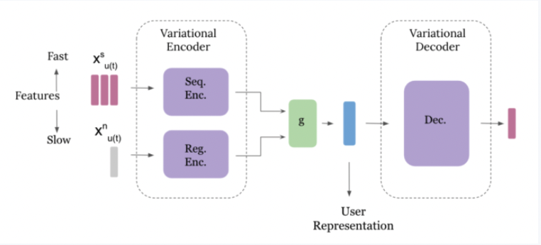

- [Modeling Users According to Their Slow and Fast-Moving Interests, 2022](https://research.atspotify.com/2022/02/modeling-users-according-to-their-slow-and-fast-moving-interests/)
  - 해당 게시물은 Variational User Modeling with Slow and Fast Features, WSDM 2022 논문에 대한 내용입니다.

## 배경
- 음악추천에서 유저의 관심은 크게 두가지 factor로 구분할 수 있습니다.
  - General preferences for music listening
  - Momentary interests in a particular type of music
- 위의 각 factor들은 slow-moving, fast-moving으로 이해할 수 있습니다. 유저는 거의 변화가 적은 취향이 있을 것 입니다. 하지만 때때로 기분과 상황에 따라 평소와 다른 음악을 들을 수도 있습니다. 그렇다면 음악을 추천할 때 이 모든 것을 고려해서 추천해야할 것입니다.
- FS-VAE 모델을 통해 다음 노래 추천 task를 진행합니다.
  - slow, fast feature들을 정의해서 사용합니다.
  - non-sequential, sequential한 정보를 이용합니다.
  - variational inference는 복잡한 유저 행동에서의 non-linearity와 음악감상 패턴을 잘 파악하게 해줍니다.

## 데이터
- 유저, 노래 데이터를 사용합니다. (28일치)
  - 노래는 word2vec모델을 이용해 80차원의 vector로 표현합니다.
  - 유저 데이터는 노래들에 대한 유저 피드백 데이터들을 사용합니다.

## 방법론

- 일반적인 유저의 취향을 고려하기 위해 regular encoder로 과거 유저 데이터를 사용합니다.
  - 2개의 feedfoward network와 LeakyReLU 사용
- 최근 취향을 고려하기 위해서 sequential encoder에 최근 유저 데이터를 사용합니다.
  - 2개 LSTM과 LeakyReLU 사용
- 이들로 user representation을 만들고 decoder로 유저의 next 노래를 예측합니다.

## 결과
- 다양한 모델들과 성능을 비교합니다.
- 성능평가는 예측한 노래와 실제 노래의 embedding vector의 distance구해서 비교했습니다. 성능이 좋았다고 합니다.

## 생각정리
- 평소에 음악앱들을 사용하면서 정리 위 내용처럼 평소 취향과 특정 순간의 취향이 다른 경우 추천하기 힘들겠다고 생각한 적이 있었습니다.
- 이런식으로 나누어서 문제를 해결하는 방법이 이해하기 쉬우면서 효과적일 것 같습니다.