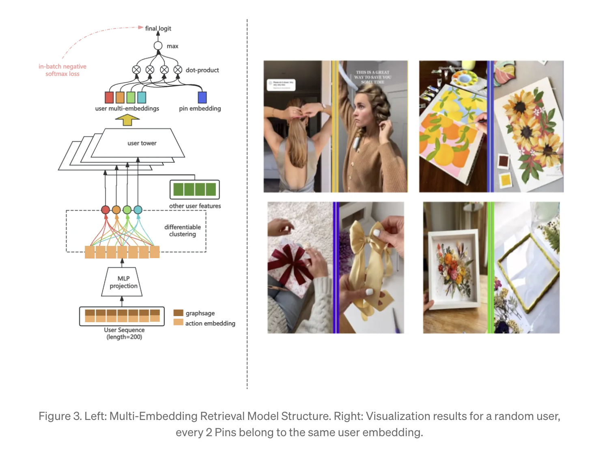
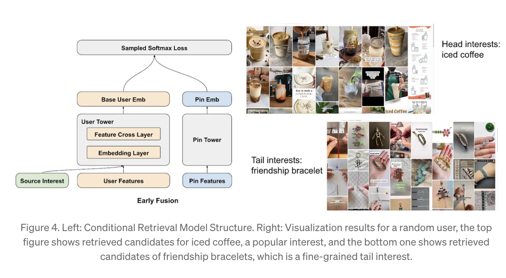

### feature crossing
- two tower 에서 각 tower 내부의 feature crossing 을 강화

### Adopting Pre-trained ID Embeddings
- pretrain large scale user and pin ID embedding
  - by contrastive learning on sampled negatives over a crosssurface large window dataset with no positive engagement downsampling
  - 훈련시 torchrec 사용하고 gpu 로 훈련하고 서빙은 cpu artifact 로 진행
  - offline inference

### Serving Corpus Upgrade
- 아래 수식으로 serving corpus 에 대해 score 를 만들고 사용한듯
- 유저별로는 아니고 그냥 전체 서비스에서 sorting 에 사용한듯
- Pin $p$

$$\sum_{n=0}^{89}(0.5 + 0.5 * 0.75^{-n}) engagements^p_{d-n}$$

### Revolutionize Embedding Based Retrieval

#### Multi-Embedding Retrieval
- 홈피드는 다양한 의도가 잇을 수 있으니 하나의 임베딩보다 다양하게 하는게 좋다
- 여러 실험해보니 Capsule Networks 을 이용한 differentiabl clustering 이 좋음
  - https://arxiv.org/pdf/1904.08030
- 그래서 아래 그럼처럼 user sequence 를 하나의 cluster 에 할당하고 
  - 유저 액션을 순서대로 이미지 임베딩 만든듯

- 서빙시에는 top k 임베딩으로 ANN search 를 진행
  - 이때 k 는 유저 히스토리 의 길이에 따라 정해짐, 유저 히스토리가 길어지면 더 다양한 유저의 의도가 담겨져 있을거라고 생각한듯

### Conditional Retrieval for Homefeed
- 특정 pin id 를 user tower 에 주입한다는 의미인듯
  - https://dl.acm.org/doi/abs/10.1145/3640457.3688057

