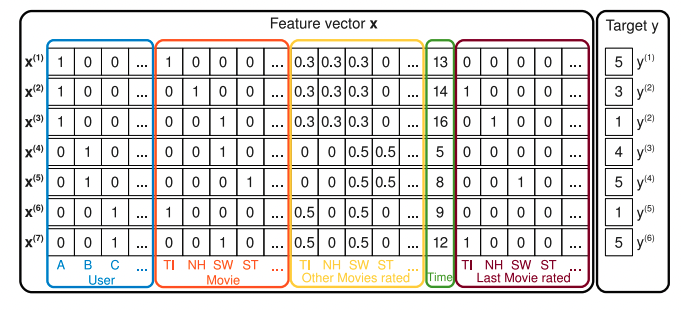

# Factorization Machine
- Factorization Machines, 2010

## 배경
- skip

## 알고리즘

- FM에서 사용하는 데이터의 형태는 위와 같습니다.
  - user와 item은 one-hot으로 인코딩하고 target값은 user-item의 interaction값입니다.
  - 나머지 feature들은 numeric, categoric 모두 올 수 있습니다.
- model equation (degree=2)
  - $n$: feature의 수
  - $k$: factor의 수 ($\vec{v}_i$의 크기)

$$\hat{y}(\vec{x}) = w_0 + \sum_{i=1}^{n}{w_i x_i} + \sum_{i=1}^{n}\sum_{j=i+1}^{n}<\vec{v}_i,\vec{v}_j>x_i x_j$$

$$w_0 \in \mathbb{R},\; \vec{w} \in \mathbb{R}^n ,\; \mathbf{V} \in \mathbb{R}^{n \ k}$$

위 식의 우항에서 우리가 estimate해야하는 것들은 순서대로 bias, 단일 feature의 계수, interaction term의 계수라고 할 수 있습니다. 여기서 눈에 띄는 특징은 interaction term의 계수가 단순한 스칼라값이 아닌 vector의 내적으로 정해진다는 것입니다. 이를 통해 sparse한 데이터셋에서도 interaction에 대한 정보를 잘 담을 수 있다고 논문은 주장하고 있습니다.

- Parameter estimation under sparsity
  - FM은 interaction parameter들을 독립적으로 계산하지 않아서 sparse한 경우에도 parameter estimation에 강점이 있습니다.
  - 예를 들어 보겠습니다.
    - a유저와 aa영화간의 interaction을 구하고 싶은데 train data에 해당 영화가 동시에 1을 가지는 경우가 없을 수 있습니다.
    - b유저가 aa영화, bb영화를 좋게 평가했다고 가정하겠습니다.
    - 그렇다면 $<\vec{v}_b,\vec{v}_{aa}>,<\vec{v}_b,\vec{v}_{bb}>$ 모두 큰 값을 가질 것입니다.
    - 그런데 이때 a유저가 bb영화를 좋게 평가했다면 어떨까요? $<\vec{v}_a,\vec{v}_{bb}>$ 의 값이 크기 때문에
    - 두 유저의 interaction값 $<\vec{v}_a,\vec{v}_b>$ 도 클 것이고 결국 a유저에게 aa영화를 추천해줄 수 있게 됩니다.
- computation
  - 위의 model equation을 정리하면 (논문에 수식 있음) linear time($O(kn)$)으로 계산할 수 있는 장접이 있습니다.
- FM은 regression, binary classification, ranking 모두 사용할 수 있습니다.

## 실험
- skip

## 생각정리
- FM이 필요한 형태의 데이터셋을 만드는데 많은 메모리가 필요해보입니다.
- 데이터셋 값들이 0,1로만 이루어진 경우는 embedding layer를 이용하면 될 것 같습니다.