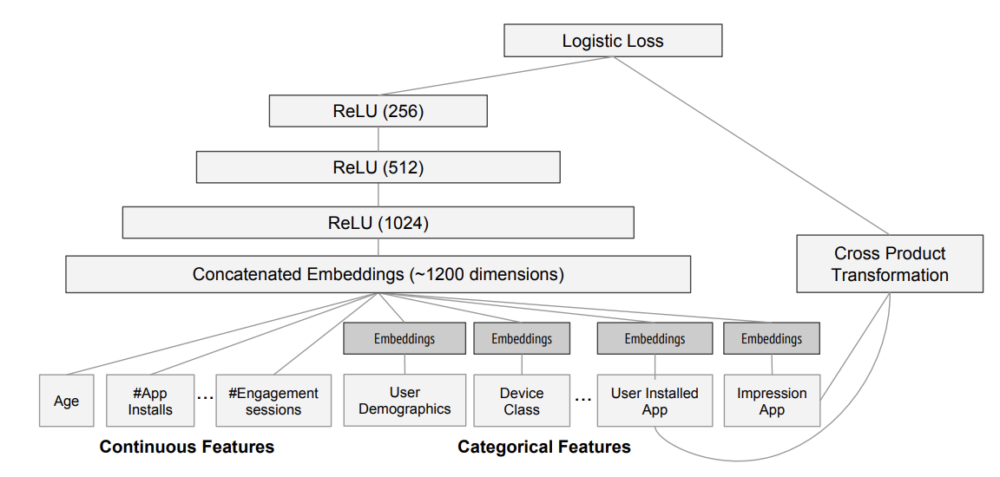

# Wide & Deep
- Wide & Deep Learning for Recommender Systems, 2016, Google Inc.

## 배경
- 해당논문은 memorization + generalization을 동시에 잘하는게 목표입니다.
  - memorization: usually more topical and directly relevant to the items on which users have already performed actions
  - generalization: tends to improve the diversity of the recommended items, explores new feature combinations that have never or rarely occurred in the past
- 해당 모델을 실제 Google play에서 mobile app store에 적용된 모델입니다.
  - wide & deep은 ranking 모델입니다.
  - 추천시스템은 크게 Retrieval과 Ranking으로 이루어져있습니다.
  - 먼저 Retrieval은 input data가 들어오면 이를 기반으로 ranking 모델에서 예측을 진행할 후보군을 생성하는 부분입니다.
    - input data는 주로 query라고 부르기도 합니다. (검색에서 사용하는 용어가 넘어온 것 같습니다)
    - 여기에는 user, contextual, impression feature 등이 들어있습니다.
  - 이 논문에서도 100개의 앱을 추린 뒤 wide & deep 모델을 통해 추천순서를 결정했다고 합니다.

## 알고리즘

### The Wide Component

wide component에서는 memorization의 역할을 합니다.

- Generalized Linear model
  - $y$: prediction
  - $\bold{x}$: raw input feature & cross-product feature

$$y=\bold{w}^T \bold{x}+b$$

- cross-product feature
  - binary features간의 feature interaction을 계산합니다.
  - nonlinearity를 모델에 더해줍니다.
  - 예를 들어서, 'gender=남자, age=20대' 라는 cross-product feature는 해당 row가 'gender=남자'이고 'age=20대'인 경우 1의 값을 갖습니다.

$$\phi_k (\bold{x}) = \prod_{i=1}^d x_i^{c_{ki}}, \;c_{ki} \in \{ 0,1 \}$$

### The Deep Component

deep component에서는 generalization의 역할을 합니다.

- sparse feature를 input으로 embedding layer에 넣고 이후 feed-forward layer에 넣어서 모델을 만들었습니다.

$$a^{(l+1)} = f(W^{(l)} a^{(l)} + b^{(l)})$$

### Joint Training
- wide, deep 부분을 jointly 학습합니다.
- 독립적으로 훈련하는 ensemble방법에 비해서 jointly 학습하면 서로의 약점을 보완하고 모델 사이즈도 더 작아집니다.
- 최종 model's prediction은 아래와 같이 정리할 수 있습니다.

$$P(Y=1|\bold{x}) = \sigma(\bold{w}_{wide}^T[\bold{x},\phi(\bold{x})] + w_{deep}^T a^l_{final} + b)$$

## 시스템
- pipline은 data generation, model training, model serving 3가지로 구성되어 있습니다.

### Data Generation

- 특정기간의 user data와 app impression data로 training data를 만듭니다.
- label은 app이 impression되고 설치 여부입니다.
- vocabulary generator는 categorical data를 숫자로 만드는 역할을 합니다.
  - categorical feature가 integer ID로 mapping되는 table이 있습니다.
- continous feature는 0과1 사이로 normalized됩니다.
  - quantile을 이용하여 bucket을 할당합니다.

### Model Training

- wide 부분에서는 user installed apps와 impression apps의 cross-product transformation으로 이루어져 있습니다.
- deep 부분에서는 각 categorical feature는 32-dim의 embedding vector를 사용하고 최종적으로 1200차원의 concatenated embedding이 만들어지고 feed-forward network를 지나갑니다.
- 모델 훈련시 리소스의 효율성을 위해 embedding과 linear modeldml weight는 이전 모델의 것으로 시작해서 훈련을 한다고 합니다.

### Model Serving
- request에 빠르게 응답하기 위해 meltithreading parallelism을 사용한다고 합니다.

## 실험
- 온라인 AB test를 진행했고 더 좋은 성능을 확인했다고 합니다.

## 생각정리
- 실제 적용이 된 모델이라 재밌어 보였다.
- 알고리즘만이 아니라 전체적인 시스템을 언급해서 추천시스템의 흐름에 대해서도 이해하기 좋은 논문이라고 생각한다.