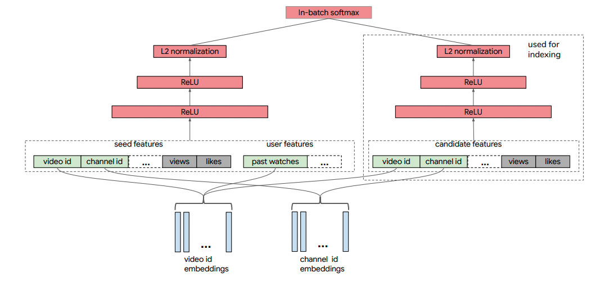
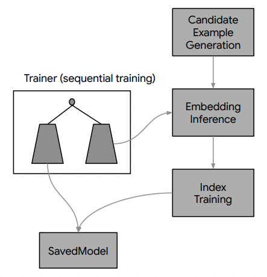

# Paper
- Sampling-Bias-Corrected Neural Modeling for Large Corpus Item Recommendations, RecSys 2019, google

## 배경
- two-tower neural net을 사용합니다.
- in-batch negative의 bias를 correction합니다.
- 이러한 방법론으로 YouTube 추천을 위한 large scale retrieval system을 구축합니다.
  - 추천은 크게 retrieval과 ranking으로 구분할 수 있습니다.
  - retrieval은 많은 item 중에서 후보군을 추리는 과정이라고 할 수 있습니다.

## 방법론
### Modeling framework
- query $x_i$ 와 item $y_i$ feature가 있고 이들을 parameterized embedding function으로 k-dimension의 embedding을 만들려고 합니다.
- 최종 output은 두 embedding의 inner product입니다. 이들로 reward $r_i$를 맞추는게 목표입니다.
- 따라서, 이는 multi-classification with continuous reward 문제라고 할 수 있습니다.
- 그래서 query가 주어지면 이에 맞는 item을 구하기 위해 일반적으로 softmax함수를 이용합니다.
- 그런데 문제는 item이 너무 많다는 것입니다.
- 이를 해결하기 위해 in-batch item을 negative로 사용합니다.
  - mini-batch가 만들어지면 negative를 그 안에서만 만든다는 의미입니다.
  - 예를 들어 [(a,b,1),(c,d,1)]의 mini-batch가 만들어지면 negative로 [(a,d,0),(c,b,0)]이 만들어지는 것입니다.
- 하지만 in-batch negative 방법론의 경우 인기있는 item이 너무 negative로 많이 학습되는 문제가 있습니다. (overly penalized as negatives)
- 이를 위해 logit $s(x_i, y_i)$ 을 약간 수정하여 bias-correction을 합니다.
  - $p_j$: sampling probability of item $j$ in a random batch

$$s^c (x_i, y_i) = s(x_i, y_i) - log(p_j)$$

- 그래서 batch loss function은 다음과 같이 됩니다.

$$P(y_i | x_i ; \theta) = \frac{e^{s^c}}{e^{s^c} + \sum_{j \in B, j \neq i} e^{s^c}}$$

$$L_B (\theta) = - \frac{1}{B} \sum_{i \in B} r_i \cdot log (P(y_i | x_i ; \theta))$$

- embedding 학습시에 normalization도 했습니다. (embedding을 L2 norm으로 나눈 것)

### Streaming frequency estimation
- 각 batch에 있는 item들의 sampling probability를 알아야하는데 multiple training jobs의 경우 쉽지 않습니다.
- 논문에서는 $\delta$를 estimation하여 확률분포 $p$를 근사하려고 합니다.
  - $\delta$: the average number of steps between two consecutive hits of the item
  - 예를 들어, item이 50 step마다 sample로 뽑히면 $p$=0.2가 됩니다.
- 먼저 hash function $h$를 이용하여 item을 넣고 이들은 output space $[H]$에 표현됩니다.
- 그리고 $H$크기의 Array $A,B$를 통해서 sampling probability를 구합니다.
  - $t$: steps
  - $A[h(y)]$: records the latest step when $y$ is sampled
  - $B[h(y)]$: contains the estimated $\delta$ of $y$
- 각 step $t=1,2,3...$ 마다 아래 과정을 반복합니다. $\alpha$는 learning rate라고 할 수 있습니다.
  - 즉, 이전에 sampled된 step과의 차이와 기존에 구한 값을 평균내서 사용합니다.

$$B[h(y)] \leftarrow (1-\alpha) B[h(y)] + \alpha (t-A[h(y)])$$
$$A[h(y)] \leftarrow t$$

- 이를 통해 $\hat{p} = 1 / B[h(y)]$를 구하는 것입니다.
- 논문에서는 이 부분에서 추가적으로 distributed training시 Array를 여러개 사용하는 방법도 제안합니다. 또한 collision을 피하기 위해 hash function도 여러개 사용을 제안한다.

### Neural retrieval systeom for youtube
- seed video가 주어졌을때, 추천을 위한 video를 뽑아내는 과정에서 위의 방법론들을 적용합니다. (retrieval 과정)
  - seed video는 user가 보고 있는 video를 의미합니다.
- 아래 그림에 나와 있듯이 크게 2가지 network가 있습니다. query와 candidate network입니다.

- training label은 video click이 positive label로 사용됩니다. click마다 reward $r_i$도 정하는데 시청시간에 따라 0,1을 지정합니다.
- video feature는 numeric, categoric 모두 있습니다.
  - categoric의 경우 embedding vector를 사용합니다.
  - (아마 몇 categoric feature 대상) out-of-vocab이 경우를 위해 fixed set of hash buckets에 이들을 random하게 할당하고 embedding 값을 구합니다.
- user feature는 user의 과거 history를 참고합니다.
  - 예를 들어, user가 최근에 본 $k$개의 video 입니다.
  - 히스토리를 BOW로 취급하여 video embedding들의 평균값을 사용합니다.
- seed, candidate, user history에서 video의 embedding은 share합니다. 동일한 id는 모두 같은 embedding을 사용하는 것입니다.
- 이렇게 모델을 훈련시킨 embedding값을 추천과정에서 이용합니다.
  - 예를 들어, 특정 user에게 추천을 하려고 할 때 candidate들을 추리고 이들의 embedding을 ranking에 사용할 수도 있습니다.

### Sequential Training
- Youtube에서는 매일 새로운 training data가 만들어집니다.
- 이 데이터들은 순차적으로 훈련하고 훈련이 완료되면 다음날 training data가 만들어지기를 기다리다가 다시 훈련을 시작합니다.
- 모델이 최근 data distribution shift에 잘 적응할 수 있습니다.

### Indexing and Model Serving
- onlilne serving을 위해 retrieval system에서 index pipeline은 Tensorflow SavedModel형식으로 저장됩니다.
  - SavedModel형식은 Tensorflow Serving에서 사용하는 모델 포맷입니다.
- index pipeline은 3단계로 이루어져있습니다.
  - Youtube corpus에서 일부 candidate를 뽑습니다.
  - candidate의 embedding을 계산합니다. (Two-tower이용)
  - Tensorflow-based embedding index model을 훈련시킵니다.
    - approximate maximum-inner-product-search (MIPS)를 위한 방법론들에 기반한 모델
    - 디테일한 내용은 이 논문의 범위는 아니라 없습니다.
    - 복잡하고 멋있는 엔지니어링적인 기술들임은 확실합니다.
- 최종 모델은 Two-tower model과 indexing model이 함께 서빙됩니다.

## 실험
- AB test한 결과는 아래와 같습니다.
  - user가 click하는 것을 기준으로 video를 추천하는 것이 ideal하지는 않지만 평가를 위해 그렇게 기준을 잡았습니다.

## 기타 관련 reference
- Two Tower Model Architecture: Current State and Promising Extensions, 2023
- Scaling deep retrieval with TensorFlow Recommenders and Vertex AI Matching Engine, 2023 Google
- Innovative Recommendation Applications Using Two Tower Embeddings at Uber, 2023 Uber
- Personalized recommendations - IV (two tower models for retrieval), 2021
- Model-based candidate generation for account recommendations, 2022 X