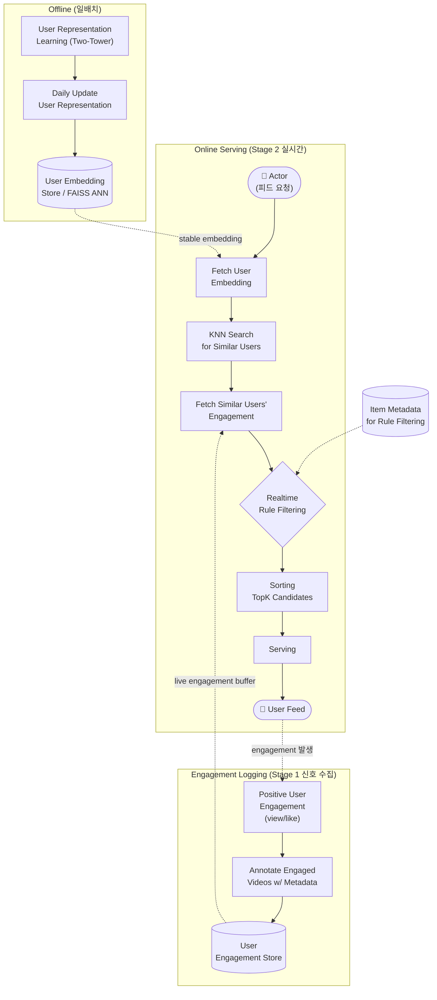

# SocRipple: A Two-Stage Framework for Cold-Start Video Recommendations

- Meta Platforms
- Amit Jaspal, Kapil Dalwani, Ajantha Ramineni

## 핵심 요약

소셜 그래프 기반 플랫폼(예: 동영상)에서 **신규(cold-start) 동영상**을 개인화된 방식으로 분산(distribution)시키기 위한 **2단계 retrieval 프레임워크**. Stage 1은 크리에이터의 소셜 연결(팔로워)을 활용해 정밀도 높은 초기 seeding을 하고, Stage 2는 초기 engagement 신호 + 안정적인 user embedding을 이용해 KNN으로 비슷한 취향의 사용자에게 "물결처럼(ripple)" 확산시킨다. 대규모 동영상 플랫폼 실험에서 cold-start 아이템 분산을 **+36%** 늘리면서 engagement rate는 유지.

## 문제 정의

- 산업 규모 추천 시스템의 핵심 난제: 신규 아이템은 상호작용 이력이 없어 신뢰할 만한 표현(representation)을 학습할 수 없음 → **item cold-start 문제**
- Embedding-plus-MLP 아키텍처는 데이터 의존적(data-hungry)이라 신규 아이템에 취약
- **Pareto 효과**: 소수의 인기 아이템이 노출을 독점 → popularity bias 강화, 카탈로그 다양성 저해
- 기존 방법의 한계:
  - **CLCRec / DropoutNet**: 콘텐츠 기반 contrastive 학습, feature dropout으로 cold-start 시뮬레이션 → 정적 콘텐츠 신호에 의존, 실시간 행동·소셜 영향 반영 못함
  - **GNN 기반 그래프 방법**: user-item / 소셜 그래프 위로 신호 전파
  - **Early-seed 방법**: 신규 아이템을 크리에이터 팔로워에게 push하지만 체계적·대규모 평가 부재
- 어떤 기존 방법도 (i) 크리에이터 중심 소셜 seeding과 (ii) 실시간 embedding 기반 neighbor 확장을 **순차적으로 결합**하지 않음 → 가장 차가운 아이템을 위한 고정밀 bootstrap, 또는 신호 도착 후 폭넓은 관련 청중에 도달하는 고재현 diffusion 중 하나가 부족

## 제안 방법: SocRipple

크리에이터 c가 올린 신규 동영상 `v_new`를 시간에 따라 관련 사용자 U에게 효율적으로 분산. 소셜 팔로워 그래프 G와 사전 계산된 안정적 user embedding `u_i ∈ R^d`를 활용.

### Stage 1: Social Boost (고정밀 초기 seeding)

목표: 빠르고 정밀도 높은 초기 seeding + 피드백 수집

1. **Identify & Ingest**: `v_new` 생성 즉시 초기 분산을 위해 ingest
2. **Retrieve Followers**: 크리에이터의 팔로워 집합 `F_c` 조회
3. **Distribute**: `F_c` 사용자들의 추천에 `v_new` boost
4. **Logging**: `F_c`로부터 초기 긍정 engagement(조회, 좋아요 등)를 실시간 로깅 → 긍정 반응한 사용자 집합 `U_engaged`

### Stage 2: Neighbor Expansion (embedding 기반 확산)

목표: 비슷한 사용자(neighbor)들이 최근 긍정 반응한 신규 동영상으로 타겟 사용자 `u^t`의 추천을 풍부하게. 사용자가 피드를 요청할 때 동작.

1. **Identify Neighbors**: in-memory 인덱스에서 `u^t`의 안정 embedding을 가져와 KNN 검색 → neighbor 집합 `N(u^t) = {u_1...u_k}`
2. **Query Neighbor Engagement**: 각 neighbor `u_j`에 대해 live engagement buffer를 조회, 최근 **24시간** 내 긍정 반응한 cold-start 동영상 집합 `V_new(u_j)` 수집
3. **Aggregate candidates**: 모든 neighbor의 신규 동영상 리스트를 합집합으로 candidate set 형성. 각 동영상마다 ① neighbor-support count(반응한 neighbor 수), ② `u^t`와 지지 neighbor 간 유사도, ③ freshness(생성 후 경과 시간) 계산
4. **Filter & selection**: 이미 `u^t`에게 노출된 동영상 제거, 경량 룰/휴리스틱 적용 후 (support count, neighbor 유사도, freshness)의 가중 점수로 랭킹. 가중치는 **A/B 테스트로 온라인 튜닝**
5. **Distribute**: 상위 랭크된 cold-start 동영상을 다른 retrieval 소스의 후보와 함께 ranking 단계로 push

### Figure 1: End-to-end 시스템 개요

**흐름 요약**
- **Offline**: Two-tower로 학습한 user embedding을 매일 갱신해 FAISS ANN 인덱스에 저장 → Online의 `Fetch User Embedding`이 사용
- **Logging**: 사용자 긍정 반응(좋아요/조회)을 메타데이터와 함께 annotate하여 Engagement Store에 적재 → Online의 `Fetch Similar Users' Engagement`가 live buffer로 조회
- **Online (Stage 2)**: 피드 요청 시 `사용자 embedding 조회 → KNN으로 유사 사용자 검색 → 그들의 신규 영상 engagement 수집 → Item Metadata 기반 룰 필터링 → TopK 정렬 → serving`

### User Representation Learning

- **Two-tower** 신경망으로 historical engagement 로그에서 user embedding 학습
- positive-only 상호작용(예: 좋아요)으로 학습, affinity는 dot product `s(u,i) = e_u^T e_i`
- **sampled softmax loss + in-batch negatives**, 목적함수는 positive 인스턴스의 negative log-likelihood 최소화
- 학습 후 user tower를 매일 offline batch로 실행해 안정적 user embedding 계산 → **FAISS ANN 인덱스**에 저장하여 Stage 2의 빠른 유사 사용자 검색 지원

## 실험

### 평가 셋업
- 대규모 동영상 플랫폼 engagement 데이터, 최근 6/12/24시간 내 생성된 cold-start 동영상 대상
- 지표: cold-start 아이템에 대한 **Recall@200**

### (RQ1) SocRipple의 효과 — vs 베이스라인
- 베이스라인: DropoutNet, Content-KNN, Item-KNN
- 모든 cold-start 버킷에서 SocRipple이 크게 우세, 특히 **가장 신선한 아이템(≤6시간)에서 상대적 이득 최대**
- 아이템 나이가 들수록 CF 베이스라인과 격차 좁혀짐 (engagement 신호 누적 시 CF가 효과적)

| Variant | ≤6h | ≤12h | ≤24h |
|---|---|---|---|
| DropoutNet | 5.8% | 7.2% | 8.8% |
| Content-KNN | 4.5% | 5.2% | 4.8% |
| Item-KNN | 3.2% | 5.4% | 7.5% |
| **SocRipple** | **12.8%** | **13.1%** | **13.2%** |

### (RQ2) User Embedding(Stage 2)의 기여 — Ablation
- Stage 1만: 4.8% → Stage 1 + Social Graph Expansion(SGE): 6.7% → Stage 1 + Stage 2(embedding 확장): **13.2%** (SGE의 거의 2배)
- 결론: embedding 기반 확장은 단순 선언적 연결(소셜 ties)이 아니라 **공유된 행동 선호(interest-based similarity)**라는 더 풍부하고 직교적인 신호에 접근 → 소셜 그래프 전파만으로는 불가능한 발견(discovery) 확장·신규 아이템 도달 가속

| Neighbor Expansion Strategy | Recall@200 (≤24h) |
|---|---|
| Stage 1 | 4.8% |
| Stage 1 + SGE | 6.7% |
| Stage 1 + Stage 2 | 13.2% |

### (RQ3) Neighbor Expansion 하이퍼파라미터 민감도
- **K (neighbor 수, 확장 breadth)**: 10→70까지 Recall 상승(최대 0.13), K=70 초과 시 먼 neighbor의 노이즈로 소폭 하락
- **M (neighbor당 cold-start 동영상 수, 확장 depth)**: 20까지 상승, 이후 plateau 후 regress → M=20으로 설정
- 확장 파라미터 튜닝으로 recall과 precision 균형이 중요

## 온라인 배포 (A/B Test)

- 프로덕션 동영상 추천 surface에서 2주간 대규모 A/B 테스트
- 기존 CF retrieval 소스에 **추가 후보 retrieval 소스**로 SocRipple 배포
- Stage 2의 실시간 KNN lookup + engagement aggregation을 고처리량 환경에 통합하기 위해 엄격한 latency 요건을 맞추는 엔지니어링 최적화 필요
- 결과(통계적으로 유의):
  - **Topline engagement +0.22%** (장기 retention과 강한 상관)
  - **Cold-start 커버리지 +36%**: 24시간 미만 아이템의 분산 share 증가, 매일 수천 개의 신규 동영상이 의미 있는 노출 도달
  - **Cold-start engagement rate 유지**: 노출 증가에도 control과 동등 → 추가된 아이템이 관련성 높고 사용자 관심과 잘 정렬됨

## Key Takeaways

- **2단계 cascading 설계**: 고정밀 소셜 seeding(Stage 1) → 고재현 embedding 확산(Stage 2)으로 exploration(신규 발견)과 exploitation(개인화)의 균형
- **소셜 그래프(선언적 연결)보다 behavioral embedding(취향 유사도)이 확산에 훨씬 효과적** (6.7% vs 13.2%)
- 신규 아이템 cold-start의 핵심: 초기 engager로부터 **의미적으로 유사한 neighbor로 실시간 ripple**
- 프로덕션에서 별도 retrieval 소스로 가볍게 추가 가능, latency 최적화가 실전 관건
