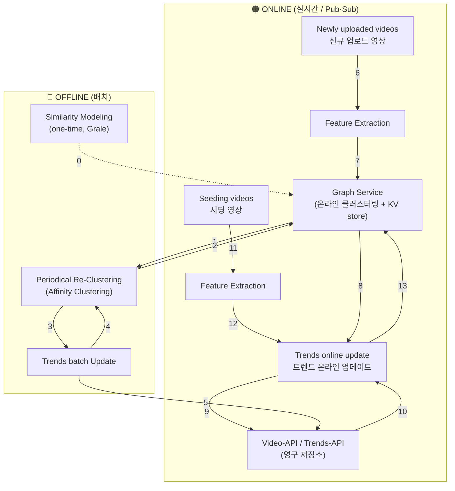

# Streaming Trends: A Low-Latency Platform for Dynamic Video Grouping and Trending Corpora Building

- **저자**: Yang Gu 외 (Google / YouTube)
- **발표**: RecSys '25 (2025, Prague)
- **분야**: 실시간 클러스터링, 트렌드 식별, 코퍼스 구축

---

## 1. 한 줄 요약

짧은 영상(short-form video) 플랫폼에서 **업로드 순간부터 트렌드로 식별되기까지의 지연(latency)을 없애는** 실시간 시스템. 온라인 클러스터링 + 유연한 유사도 측정으로 새 업로드를 관련 그룹에 **거의 실시간(3분 이내)** 으로 연결한다.

---

## 2. 문제 의식 (Motivation)

- 짧은 영상 플랫폼은 규모가 크고 트렌드가 매우 빠르게 생겼다 사라짐.
- **기존 배치(batch) 처리 방식의 한계**:
  - 콘텐츠 생성 → 트렌드 인식까지 큰 지연 발생 (레거시 시스템은 평균 **8시간**).
  - 초기 시딩(seeding) 영상 기준 **고정 유사도 임계값**을 사용 → 바이럴 콘텐츠의 성장/진화를 반영 못하는 정적(static) 트렌드 정의.

---

## 3. 핵심 기여 (Contributions)

1. **데이터 모델**: graph / trend / seed / video-assignment 를 포함, 프로덕션 수준의 **실험(experimentation) 가능성**을 위해 설계.
2. **실시간 저지연 인프라**: 동적 온라인 클러스터링 & 연결(association)을 오프라인 모델링 + 재조정(reconciliation)과 통합하여 클러스터 안정성과 일관성 균형.
3. **대규모 배포 성공**: 식별 지연 감소, 코퍼스 커버리지 향상, 사용자 만족도 & 신규 콘텐츠 시청 활동 증가 입증.

---

## 4. 데이터 모델 (Data Model)

신규 영상을 제품 요구에 맞춘 하나 이상의 특화된 **그래프(graph)** 에 삽입.

### 4.1 Graph
그래프는 여러 요소로 버전이 구분됨:
- **Entity Type**: 노드가 되는 항목 (영상, 채널 등). 논문은 영상 기준이지만 일반화 가능.
- **Similarity Measurement**: 그래프별 유사도 정의 방식. Grale [3] 기반으로 제품 맥락에 따라 다른 피처/모델 사용. → 노드 간 엣지 및 **엣지 가중치(연결 강도)** 결정.
- **Corpus Conversion Trigger**: 클러스터링은 계층 없는 flat cluster(각자 고유 cluster ID) 리스트를 만듦. 클러스터가 자동으로 트렌드가 되진 않음 → 제품별 조건 충족 시 "corpus cluster"(트렌드)로 전환.
  - 예: evergreen 코퍼스는 지속적 신규 영상 유입, trending 코퍼스는 seed 영상과의 연결.

  > **📌 이해 포인트 — 클러스터 ≠ 트렌드**
  >
  > - **Cluster**: 유사도 클러스터링이 만든 "단순히 비슷한 영상들의 묶음" (고유 ID, 계층 없음). 강아지 영상 3개, 우연히 같은 BGM 쓴 영상 5개 등 **의미 없는 우연한 묶음도 포함**.
  > - **Corpus Cluster = Trend**: 그 클러스터 중 특정 조건을 통과해 **"의미 있는 트렌드"로 승격된 것**. 다운스트림(추천 시스템)에서 실제로 소비됨.
  > - **모든 클러스터가 트렌드가 되진 않음** → 승격 여부를 판단하는 관문이 **Corpus Conversion Trigger**. 판단 기준은 만들려는 코퍼스의 목적에 따라 다름:
  >   - **Evergreen**(오래 꾸준히 관심받는 콘텐츠, 예: 레시피/운동): 신규 영상이 **꾸준히 유입되는가**(sustained activity)가 조건.
  >   - **Trending**(지금 급부상하는 트렌드, 예: 이번 주 댄스 챌린지): 클러스터가 **seed 영상과 매칭되는가**가 조건.
  >
  > ```
  > [모든 영상] → 클러스터링 → [수많은 flat 클러스터] → Conversion Trigger 통과 → [Trend]
  >                                                        ├ Evergreen: 신규 영상 꾸준히 유입?
  >                                                        └ Trending: seed 영상과 매칭?
  > ```

### 4.2 Seed
- **트렌드 전환(corpus conversion)의 트리거** 역할을 하는 예시(exemplar) 영상 = 잠재 트렌드의 초기 앵커.
- Seed 식별 방법 자체는 본 논문 범위 밖 (전문가/트렌딩 키워드 등).
- **Seed version**: 시딩 소스 + 사용 모델 + 모델 버전을 인코딩 → **실험 및 기여도 추적(attribution)** 가능.

### 4.3 Trend
- **cluster ID**로 고유 식별 (그래프 버전에 의존).
- Trend-API로 기존 트렌드 조회 또는 신규 트렌드 레코드 생성.

### 4.4 Video-to-Trend Association
- Seed version이 **association version**으로 전파됨.
- Association version = (트렌드를 식별한 seed version) + (현재 온라인 클러스터링 그래프 버전) 을 **연결(concatenate)**.
- → 시딩 측 변경과 유사도 모델링/클러스터링 측 변경의 효과를 **정밀 추적/실험** 가능.
- 트렌드 cluster ID(통합된 트렌드 정체성)와 association version(연결이 어떻게 이뤄졌는지의 맥락)을 구분하는 것이 중요.

  > **📌 이해 포인트 — "왜 연결에 버전 딱지를 붙이나?"**
  >
  > - Association = "영상 A가 트렌드 X에 **속함**"이라는 관계. 그냥 이것만 저장하는 게 아니라 **"어떻게/왜 그렇게 연결됐는지"** 까지 딱지로 붙여 저장한다.
  > - `association version = [seed version] + [graph version]`
  >   - **seed version**: 이 트렌드를 트리거한 seed의 출처/모델/버전 (어떤 seed 때문에 식별됐나)
  >   - **graph version**: 이 영상을 클러스터에 넣을 때 쓴 클러스터링 그래프 버전 (어떤 유사도 모델로 묶였나)
  > - **왜?** 시스템 개선은 **① 시딩 알고리즘 변경**, **② 유사도/클러스터링 모델 변경** 두 갈래로 나뉨. 딱지가 없으면 트렌드 품질이 좋아져도 "seed 덕분? 모델 덕분?"을 구분 못 함 → 딱지를 붙여두면 두 효과를 **분리해서 A/B 실험**할 수 있음. (= 논문 1번 기여 "experimentation ability")
  > - **주의**: 트렌드 X는 **하나(통일된 cluster ID)** 지만, 거기 붙은 영상들은 각자 **다른 seed/graph 조합**으로 붙었을 수 있음. → 트렌드 정체성(무엇)은 유지, 연결 경로(어떻게)는 세밀히 추적.

---

## 5. 시스템 구성 (System Components)

온라인 실시간 처리 + 오프라인 배치 업데이트의 결합.

### 📊 Figure 1 재현 — 플랫폼 인프라 개요

점선(`Online / Offline`)을 기준으로 위쪽은 실시간 Pub/Sub 흐름, 아래쪽은 배치 흐름. 숫자는 논문의 flow 번호.



**흐름 번호 요약**

| flow | 방향 | 의미 |
|:----:|------|------|
| **0** | Similarity Modeling → Graph Service | 학습된 유사도 모델 저장 (버저닝) |
| **6→7** | 신규 업로드 → 피처 추출 → Graph Service | 실시간 온라인 클러스터링 (KV store에 할당) |
| **8** | Graph Service → Trends online update | 신규 영상 삽입 완료 트리거 |
| **9,10** | Trends online update ↔ Video/Trends-API | 트렌드 조회·생성 및 video-to-trend 연결 기록 |
| **11→12** | 시딩 영상 → Pub/Sub → 피처 추출 → 온라인 업데이트 | seed 게시 및 처리 |
| **13** | Trends online update → Graph Service | seed로 매칭 클러스터 탐색 |
| **1→2** | Graph Service ↔ Re-Clustering | 스냅샷 떠서 처음부터 재클러스터링 후 동기화 (품질 유지) |
| **3,4** | Re-Clustering ↔ Trends batch Update | 클러스터 멤버십 변화 식별 |
| **5** | Trends batch Update → Video/Trends-API | 변화된 video-to-trend 연결 전파 |

> **핵심 대비**: 위쪽(온라인)은 업로드/시딩 이벤트마다 **즉시** 클러스터에 붙이는 저지연 경로, 아래쪽(오프라인)은 주기적으로 **전역 재클러스터링**해서 온라인이 누적한 품질 저하를 교정하는 경로. 둘이 Graph Service와 API를 공유하며 맞물려 돈다.


### 5.1 오프라인 처리 (Batch Flow)
- **Similarity Modeling**: 휴리스틱 기반 pair-wise 피처의 선형 결합 또는 Grale [3]로 오프라인 학습. 모델은 Graph Service에 저장(flow 0), 트렌드 버저닝의 일부.
- **Periodical Re-Clustering**: 온라인 클러스터링만으로는 전역(global) 관점이 없어 품질 저하 누적됨. → 배치 잡이 주기적으로 온라인 그래프 스냅샷(flow 1)을 떠 **Affinity Clustering [1]** 로 처음부터 재클러스터링, 클러스터 ID를 온라인 버전에 매핑(영상 겹침 분석). 결과 온라인에 동기화(flow 2).
  - **안정성(stability)** = 두 버전 간 같은 cluster ID에 남아있는 영상 비율.
- **Trends Batch Update & Propagation**: 재클러스터링 결과로 클러스터 멤버십 변화 식별(flow 3, 4) → 영구 저장소 API로 video-to-trend 연결 업데이트(flow 5).

### 5.2 온라인 처리 (Pub/Sub Flow)
- **Video Uploads & Feature Handling**: 신규 업로드가 온라인 플로우 트리거(flow 6), 유사도 모델용 피처 추출(flow 7).
- **Online Clustering Graph Service** (핵심):
  - 추출 피처 + **LSH(locality sensitive hashing)** 로 후보 이웃 탐색.
  - 서빙된 유사도 모델로 이웃과의 유사도 계산 → 기존 클러스터에 할당 or 싱글톤 클러스터 생성.
  - 내부적으로 **분산 Key-Value store**로 영상 피처 & video-to-cluster 그래프 유지, 실시간 할당.
  - 영상은 **TTL(Time-To-Live)** 동안만 온라인 그래프에 유지, 이후 GC로 자동 제거.
- **Trend Creation & Association**: 신규 영상 삽입 완료(flow 8) 또는 seed 매칭 요청(flow 12)으로 트리거 → 기존 트렌드 연결 or 신규 생성 결정, Trend-API/Video-API 조회 및 기록(flow 9, 10).
- **Seed Publishing & Processing**: 시딩 영상 게시 → Pub/Sub 메시지(flow 11) → 피처 추출 후(flow 12) 구독자가 온라인 그래프에서 매칭 클러스터 탐색 후 트렌드 생성 여부 결정(flow 13, 8, 9, 10).

### 5.3 🎬 신규 업로드 → 추천까지의 여정 (End-to-End)

신규 영상 하나가 올라온 순간부터 실제 추천에 쓰이기까지의 전 과정:

1. **업로드 → 이벤트 발생 (flow 6)**: 새 영상이 올라오면 **Pub/Sub 메시지**가 즉시 발행돼 온라인 파이프라인 트리거. (배치처럼 다음 스케줄을 기다리지 않음 = 저지연 핵심)
2. **피처 추출 (flow 7)**: 유사도 모델이 필요로 하는 피처를 중앙 feature API로 수급해 추출.
3. **온라인 클러스터링 — Graph Service (flow 7)**:
   - ① **LSH**로 "비슷할 법한" 후보 이웃만 빠르게 추림 (전체 비교 회피).
   - ② 서빙 중인 유사도 모델로 후보 이웃과 유사도 계산.
   - ③ 결정: 충분히 비슷한 클러스터 있으면 **기존 클러스터 합류**, 없으면 **싱글톤 클러스터 생성**.
   - ④ 결과(피처, video-to-cluster 매핑)를 분산 **KV store**에 실시간 기록. 영상은 **TTL** 동안만 유지.
   > 💡 ①②는 임베딩 **ANN**의 일종 — LSH가 최종답이 아니라 **후보 선별(recall)** 1차 필터이고, 학습된 유사도 모델이 **정밀 스코어링(precision)**. 추천의 retrieval→ranking과 같은 2단 구조.
   > 💡 이 클러스터 배정(video→cluster)은 KV store 내부 상태로 **TTL 지나면 GC로 소멸하는 임시 데이터** — 5단계에서 영구 저장되는 "연결"과 구분됨.
4. **트렌드 생성/연결 판단 (flow 8 → 9, 10)**: 배정 완료되면 (이벤트 기반) Trends online update가
   - 이 클러스터가 **이미 트렌드인지** Trend-API로 조회(flow 9). **cluster ID가 트렌드 조회 키** — 레코드 있으면 트렌드, 없으면 아직 아님.
   - 맞으면 **"이 영상은 이 트렌드 소속"이라는 도장을 찍어** Video-API에 **연결(association)** 기록(flow 10). 저장 내용 = `영상 ID + 트렌드 cluster ID + association version(seed+graph)`.
   - 아직 트렌드가 아니면 **Corpus Conversion Trigger** 조건을 판단(통과 시 신규 트렌드 생성).
   > 💡 트렌드 여부는 상시 계산되는 값이 아니라 **Trend-API에 저장된 상태(레코드)**. 판단은 이벤트 시점에 그때그때 하고 결과를 써놓으며, 조회는 그 상태를 읽는 lookup.
   > 💡 왜 연결을 따로 저장? 클러스터 배정은 임시(TTL)지만, "영상↔트렌드" 관계는 **다운스트림이 소비할 영구 결과물**이라서.
5. **Seed 경로 (병렬, flow 11→12→13)**: **seed = 트렌드의 씨앗/앵커 대표 영상** — 일반 클러스터를 트렌드로 **승격시키는 방아쇠(지목자)**.
   - **seed 식별(무엇을 seed로?)** 은 **외부 / 논문 범위 밖(out of scope)** — 전문가 지정, 트렌딩 키워드 등. 이 단계가 배치인지 실시간인지는 논문이 확정하지 않음.
   - **seed 게시·처리(seed → 트렌드 연결)** 는 **Pub/Sub(온라인)**: 식별된 seed가 persistence API로 게시되면 Pub/Sub 메시지 발행(flow 11) → 피처 추출(flow 12) → 구독자가 온라인 그래프에서 매칭 클러스터 탐색(flow 13) → 트렌드 승격/연결(flow 8, 9, 10). **배치가 아님** — 저지연 유지를 위해 seed도 이벤트 기반으로 즉시 처리.
   > 💡 클러스터가 트렌드가 되는 계기는 두 갈래 — **① 신규 영상 지속 유입 조건 충족(evergreen 스타일) / ② seed 매칭(trending 스타일)**. seed 경로는 영상 업로드가 없어도 독립적으로 Trends online update를 트리거함.
   > 💡 헷갈리기 쉬움: 정작 **배치로 도는 건 seed가 아니라 오프라인 재클러스터링 + Trends batch update(flow 1~5)** — 저장된 클러스터/연결의 품질 교정용이지 seed를 다루지 않음.
6. **다운스트림 소비 (추천)**: ⚠️ **Streaming Trends 자체는 사용자에게 영상을 추천하지 않음.** "트렌드 코퍼스"라는 **재료**를 만들어 추천 시스템에 공급하는 역할. 코퍼스는 두 가지로 쓰임:
   - **Candidate Generation**: "이 트렌드에 속한 영상들"을 추천 후보 풀로 제공.
   - **Ranking Features**: "이 영상은 어떤 트렌드 소속" 정보를 랭킹 모델 입력 피처로 사용.

> **저지연이 추천에 중요한 이유**: 레거시는 트렌드 식별에 8시간 → 인식될 즈음 이미 유행이 식음. Streaming Trends는 3분 이내라 **영상이 막 뜨는 시점에 바로 추천 후보로 투입** 가능 → 신규 콘텐츠(7d fresh) 시청 활동·만족도 상승으로 직결(6.4 참고).

---

## 6. 평가 및 실험 (Evaluation & Experiment)

### 6.1 식별 지연 (Identification Latency)
- 동일 seed 영상으로 레거시 vs Streaming Trends 비교.
- 레거시: 평균 **8시간** (처음부터 배치 처리하는 구조가 병목).
- Streaming Trends: **3분 이내** — 이벤트 기반 + 증분 처리로 병목 제거.

### 6.2 클러스터링 안정성 (Clustering Stability)
- 30일 윈도우로 주기적 재클러스터링, 영상은 60일 유지, 25개 미만 클러스터는 분석 제외.
- 연속 재클러스터링 간 할당 유지 영상 비율: 대부분 **95%**, 최저에도 **85% 이상**.
- 모든 클러스터가 트렌딩 코퍼스에 들어가는 건 아니므로 트렌드 레벨 안정성은 더 높을 것 → 충분히 안정적.

### 6.3 코퍼스 분석 (Corpus Analysis)
- 음악 기반 트렌드 대상 (Fig. 3). 지난 30일 최다 영상 생성 'Top songs' 식별.
- Streaming Trends가 프로덕션 대비 **더 많은 song-driven 생성**을 식별.
- 단, 곡(song)만으로 나누는 건 불충분 — 한 곡이 dance/lipsync 등 다양한 트렌드 카테고리와 템플릿을 낳음. 더 세밀한 그룹핑(trend coherence)이 배포/개인화 개선으로 이어짐.
- 결과 트렌드 코퍼스는 다운스트림 추천 시스템의 **후보 생성(candidate generation) 및 랭킹 피처** 소스로 소비됨.

### 6.4 라이브 실험 (Live Experiment)
- 수십억 사용자 대상 short-form 시스템에서 X주간 A/B 테스트.
- 대조군/실험군 동일 추천 시스템, 실험군만 Streaming Trends 코퍼스로 교체.
- 결과: 7일 신규 콘텐츠 기준 **사용자 만족도 +1Y%**, **시청 활동 +2Z%** (모두 유의미). (Y, Z는 익명화용 상수)

---

## 6.5 심화 이해 (Q&A 정리)

논문을 뜯어보며 헷갈렸던 지점들을 정리.

### Q1. LSH로 이웃을 찾는 게 임베딩 ANN 같은 건가?
- **맞음. LSH는 ANN(Approximate Nearest Neighbor)을 구현하는 알고리즘 중 하나.** (ANN = "무엇을", LSH·HNSW·IVF/PQ 등 = "어떻게")
- LSH 핵심 아이디어: **"비슷한 벡터는 같은 해시 버킷에 떨어지도록" 설계된 해시 함수** → 같은 버킷의 소수 후보만 꺼내 전수비교(O(N)) 회피.
- 단, 흔한 "임베딩 ANN(단일 벡터 거리 검색)"과 미묘하게 다름 → 여기선 **2단 구조**:
  1. **LSH = 후보 선별(recall)**: 싸게 후보 좁히기
  2. **학습된 유사도 모델(Grale 등) = 정밀 스코어링(precision)**: 후보와만 비싼 계산
  - 추천 시스템의 **retrieval → ranking** 패턴과 동일. LSH는 최종답이 아니라 **1차 필터**.

### Q2. Trends online update는 영상 생성과 별개로 계속 도나?
- **독립 백그라운드 루프가 아니라 "이벤트 기반(event-driven)" 컴포넌트.** 이벤트가 와야 실행됨.
- 트리거 소스 **2개**: ① 신규 영상 삽입 완료(flow 8), ② seed 매칭 요청(flow 12).
- "영상과 독립적으로도 돈다"가 맞는 이유는 **seed 경로(flow 11→12→13)** 때문 — 업로드가 없어도 seed 게시만으로 트리거됨.
- 하지만 **"영상과 완전 별개로 항상 도는 것"은 오히려 오프라인 배치 재클러스터링(5.1)** — 이벤트 무관하게 주기적으로 돌며 품질 교정.

### Q3. 트렌드 계산이 따로 돌고, Trend-API로 클러스터의 트렌드 여부를 알 수 있나?
- **Trend-API 조회는 맞음**: **cluster ID가 곧 트렌드 조회 키**. 조회 → 레코드 있으면 트렌드, 없으면 아직 아님(필요 시 생성).
- 단, **"트렌드가 상시 계산되고 있다"는 아님.** 트렌드 여부는 계산 중인 값이 아니라 **Trend-API에 저장된 상태(레코드)**.
  - 판단은 이벤트 시점에 Trends online update가 그때그때 하고 **결과를 써놓음** → 조회는 그 저장된 상태를 읽는 **lookup**.
- "따로 상시 도는" 주체는 **오프라인 배치**(재클러스터링 + Trends batch update) — 새 판단이 아니라 **저장된 트렌드/연결의 품질 교정·동기화** 담당.

### Q4. "클러스터가 트렌드면 영상을 연결한다"가 무슨 뜻? Video-API엔 뭘 기록? seed는?
- **연결(association)**: 새 영상이 어떤 클러스터에 배정됐는데 그 클러스터가 이미 트렌드면, **"이 영상은 이 트렌드 소속"이라는 도장을 영구 저장소에 남기는 것.**
  - 클러스터 배정(video→cluster)은 Graph Service 내부 상태로 **TTL 지나면 GC로 소멸(임시)**. 반면 영상↔트렌드 연결은 **다운스트림이 소비할 영구 결과물**이라 별도 저장.
- **Video-API에 기록되는 것**: `영상 ID + 트렌드 cluster ID + association version(=seed version + graph version)`.
  - 비교 — **Trend-API**: 트렌드 자체 메타데이터(존재 여부) / **Video-API**: 어떤 영상들이 그 트렌드에 붙었나(연결).
- **seed**: 트렌드의 **씨앗/앵커 역할을 하는 대표 예시 영상**. 일반 클러스터를 트렌드로 **승격시키는 방아쇠(지목자)**.
  - 전문가·트렌딩 키워드 등이 "이게 트렌드다"라고 지목 → 온라인 그래프에서 매칭 클러스터 탐색 → 그 클러스터를 트렌드로 승격.
  - 클러스터가 트렌드가 되는 두 갈래 중 **② seed 지목(trending 스타일)** 의 핵심. (①은 신규 영상 지속 유입 = evergreen 스타일)

---

## 7. 핵심 인사이트 / Takeaways

- **"Upload to trend" 지연 제거**가 핵심 가치 — 8시간 → 3분.
- **온라인(실시간 증분) + 오프라인(전역 재클러스터링)** 하이브리드로 저지연과 품질(안정성)을 동시 확보.
- **버저닝 기반 데이터 모델**(seed version + graph version → association version)이 프로덕션 실험/기여도 추적의 핵심.
- 고정 임계값 대신 **동적 유사도 그래프 클러스터링**으로 진화하는 바이럴 트렌드에 대응.

---

## 8. 관련 레퍼런스

- **[1] Affinity Clustering** (Bateni et al., NeurIPS 2017, Google): 대규모 계층적 클러스터링 → 오프라인 재클러스터링에 사용.
  > **📌 어떤 방법인가** — **Borůvka의 MST 알고리즘 기반 상향식(agglomerative) 계층적 클러스터링.** "품질 좋은 계층 클러스터링 + MapReduce로 잘 병렬화됨"을 동시에 달성 → 수십억 노드 규모에 적합.
  > - **원리(Borůvka)**: 데이터를 유사도 가중 그래프로 봄. 매 라운드 **모든 클러스터가 동시에 "가장 유사한 이웃"을 하나씩 가리켜 병합** → 클러스터 수가 라운드마다 급감 → **O(log n) 라운드**에 dendrogram 완성.
  > - **vs 전통 HAC**: HAC는 매 스텝 한 쌍만 병합(O(n²~n³))이라 대규모 불가. Affinity는 **한 라운드에 여러 병합을 동시에** → 분산 친화적.
  > - **왜 이 논문에서?** 오프라인 재클러스터링(5.1)은 전체 스냅샷을 **from scratch**로 다시 묶어야 함 → ① 수십억 노드 확장성, ② 계층 구조, ③ 재현 가능한 고품질을 모두 만족.
  > - **vs k-means**: k를 미리 안 정해도 되고(계층을 만든 뒤 컷), **임의의 학습된 pairwise 유사도 그래프**에서 작동. (이름 비슷한 *Affinity Propagation*과는 무관 — 혼동 주의.)
- **[2] Large-Scale Graph Building in Dynamic Environments** (arXiv:2507.10139, 2025): 온라인 클러스터링 그래프 서비스 기반.
- **[3] Grale** (KDD 2020): 그래프 학습용 네트워크 설계 → 유사도 모델링에 사용.
- **[4] Stability estimation for unsupervised clustering** (2022): 클러스터 안정성 측정 근거.
- **[5] Optimizing for Participation in Recommendation System** (RecSys 2024): 레거시 고정 임계값 seeding 방식 관련.
