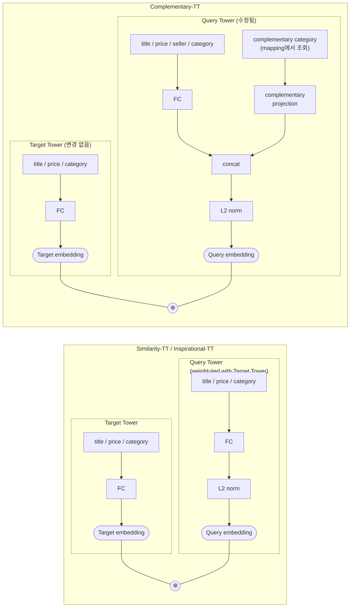

# Suggest, complement, inspire: story of Two Tower recommendations at Allegro.com

- **저자**: Aleksandra Osowska-Kurczab, Klaudia Nazarko, Mateusz Marzec, Lidia Wojciechowska, Eliška Kremeňová (Allegro.com)
- **연도**: 2025 (RecSys '25)
- **링크**: https://doi.org/10.1145/3705328.3748135 (arXiv:2508.03702)

---

## 1. 배경 & 문제 정의

Allegro는 중부유럽 최대 이커머스 마켓플레이스(월간 활성 구매자 2천만+, 판매자 15만+). 추천은 GMV·광고 매출에 직결되는 핵심 기능이지만, 다음 3가지 과제가 있다.

1. **수십 개 placement(추천 노출 위치)를 아우르는 범용 아키텍처 설계**
2. **과도한 유지보수 비용 절감**
3. **극도로 동적인(신상품 유입이 많고 롱테일이 큰) 카탈로그 관리**

업계에서 흔한 두 갈래 해법은 각각 한계가 있다.
- **대형 foundation model** (예: 360Brew, HSTU): 서빙 인프라가 무겁다.
- **task별 전용 모델을 여러 개**: 유지보수 비용·복잡도 폭증.

**이 논문의 기여**: 동일한 Two Tower 아키텍처의 일부 구성요소(주로 query tower)만 바꿔서 **유사(similarity) / 보완(complementary) / 발견(inspirational)** 이라는 서로 달라 보이는 3가지 추천 task를 전부 "유사도 검색의 변형"으로 재정의해 하나의 플랫폼으로 서빙. 2년간의 A/B 테스트로 효과 입증.

---

## 2. 공통 기반: Similarity Two Tower (Similarity-TT)

- **item-to-item 유사도 검색** (예: 대체 상품 추천)에 쓰이는 canonical DLRM 기반 TT 모델.
- 상품 수가 수억 개 규모 → **sampled softmax + mixed negative sampling**으로 학습하는 classification 문제로 정식화.
- **상품 ID embedding을 직접 학습하지 않음** (상품 회전율이 높아 overfitting 위험) → 대신 **title, price, category(계층적 taxonomy) 등 content feature**를 각각 embedding table에 통과 → concat → MLP → L2 normalize.
- **query tower와 target tower의 weight tying** → 학습 속도/안정성 향상. 이 공유 구조를 **Product Encoder**라 부름.

> **Product Encoder란?** 상품 하나를 embedding 벡터로 바꿔주는 공유 신경망. 상품 ID를 직접 학습하는 대신 **content feature로 상품을 표현**한다.
> ```
> title, price, category(계층 taxonomy), ...
>    → 각 feature를 별도 embedding table에 통과
>    → 전부 concat
>    → FC(MLP)
>    → L2 normalize
>    → 상품 embedding
> ```
> 신상품(cold-start)도 feature만 있으면 바로 embedding 생성 가능하고, ID embedding table이 필요 없어 가볍다. 이 논문의 핵심은 **이 Product Encoder를 세 모델이 그대로/거의 그대로 재사용**한다는 것 — Similarity-TT는 query/target 양쪽에 대칭으로, Complementary-TT는 target 쪽은 그대로 두고 query 쪽에만 seller/complementary category를 추가(Figure 2 참고), Inspirational-TT는 Product Encoder 자체는 완전히 그대로 두고 출력을 hierarchical ANN index에 넣어 다양성만 조절한다.

- 학습 데이터: **co-viewed 상품 쌍** (최소 co-occurrence 임계치 이상만 사용).
- 오프라인(학습: GPU 1장, NVIDIA T4 16GB로 충분) / 온라인(Faiss ANN index, 매일 갱신) 분리. 실시간 서빙은 ms 단위 지연.
- **장점**: content 기반이라 (1) 협업 필터링을 보완해 cold-start 완화, (2) 상품 ID embedding table이 필요 없어 학습/서빙 경량화.

---

## 3. Complementary Two Tower (Complementary-TT)

**목표**: 보완 상품 추천 (예: 테니스 라켓 → 테니스 공).

- Product Encoder는 그대로 두고 **query tower만 수정** (target tower는 불변, Fig 2).
- Query tower에 **complementary category mapping**(one-to-many, co-purchase 통계 모델+외부 라벨링+도메인 지식으로 구축)을 추가 입력으로 넣음.
  1. mapping에서 target category를 가져와 Product Encoder와 동일한 category embedding table로 임베딩
  2. query 상품 embedding과 target category embedding을 concat → 최종 query 표현
- Loss에 **target category reconstruction error**를 추가해 target category embedding의 정확성을 강제 (P-Companion류 아이디어 차용).
- Similarity-TT 대비 **seller feature 추가** (같은 판매자에게서 한 번에 구매하는 co-purchase 유인 반영).
- 학습 데이터: **co-purchase 쌍**, complementarity 관계 휴리스틱으로 필터링.
- 서빙: Similarity-TT와 동일 인프라, query 상품 + target complementary category로 질의만 다름. 여러 target category가 매핑되면 결과를 **interleave**해 캐러셀 다양성 확보.

---

## 4. Inspirational Two Tower (Inspirational-TT)

**목표**: 유저의 열람 이력과 느슨하게 연관되면서도 **다양한(diverse)** 상품으로 탐색을 유도.

- 모델 자체는 Similarity-TT의 Product Encoder를 재사용. 대신 **계층적(hierarchical) ANN index**로 통제 가능한 다양성을 구현 (PinnerSage와 유사한 접근).

**Hierarchical ANN index 구성 절차**:
1. 모든 상품을 Product Encoder로 임베딩 → k-means로 k개 클러스터(2단계 index) 생성, 각 클러스터는 centroid로 대표되어 top-level index에 등록.
2. 유저 표현: 최근 7일 내 최근 열람 100개 상품을 category별로 집계, 각 category에서 **가장 최근 열람 상품**을 대표로 선정.
3. 각 category 대표 상품을 Product Encoder로 인코딩 → top-level index 질의 → category별 **가장 가까운 n개 클러스터** 선택 (n이 클수록 다양성↑). 너무 유사한 결과를 피하려고 **가장 가까운 l개 클러스터는 skip 가능**.
4. 선택된 클러스터(2단계 index)에서 각 category별 유사 상품을 가져와 **interleave**하여 최종 후보 리스트 구성.

- Product Encoder 구조는 그대로, 온라인 인프라만 hierarchical index + 최근 열람 이력 집계 로직을 추가.

### Figure 2. 두 아키텍처 비교 (Similarity/Inspirational-TT vs Complementary-TT)



- 왼쪽(Similarity/Inspirational-TT): query·target tower가 **weight tying**된 대칭 구조. feature는 title/price/category 뿐.
- 오른쪽(Complementary-TT): **target tower는 그대로**, query tower에만 **seller feature**와 **complementary category → projection → concat** 경로가 추가됨. 즉 두 아키텍처의 유일한 차이는 query tower 안쪽 point 하나.

---

## 5. 결과

프로덕션 규모: **초당 2만 요청, p99 CPU 지연 40ms**. 동일 시스템으로 자전거 쿼리 시 Similarity-TT는 동일 브랜드/모델의 색상만 다른 자전거, Complementary-TT는 헬멧·무릎보호대 등 보완재, Inspirational-TT는 벨·램프·장식품 등 시각적으로 다양하고 느슨하게 연관된 상품을 반환 (Fig 1).

### 5.1 상품 페이지 추천 (Table 1)

Similarity-TT("Others also viewed")와 Complementary-TT("Order in one parcel", Sports/Travel/Fashion 부문 한정)를 기존 협업 필터링(co-viewed/co-purchased 모델)의 **fallback 후보 생성기**로 A/B 테스트. 지표: CTR(참여), GMV per visit(수익).

| model | mobile CTR | mobile GMV | desktop CTR | desktop GMV |
|---|---|---|---|---|
| Similarity-TT | +2.11%* | +0.13% | +2.37%* | +0.29% |
| Complementary-TT | +1.62%* | +0.09% | +1.06%* | +0.31% |

(* p<0.01) 두 모델 모두 CTR을 유의하게 개선 — content 기반 모델이 숨은 상품 관계를 잘 포착함을 시사. GMV 개선은 주로 desktop에서 관측(모바일/데스크톱 사용 패턴 차이로 추정).

### 5.2 Inspirational 추천 (Table 2, desktop)

상품 페이지 "How about..." 섹션에 Inspirational-TT를 캐러셀 vs 무한 피드(infinite feed) 형태로 A/B 테스트 (단일 열람 상품만으로 질의, 이전 이력 미사용).

| view | CTA | CVR | bounce rate | exit rate |
|---|---|---|---|---|
| carousel | +3.12%* | +1.38%* | -4.09%* | -1.82%* |
| infinite feed | **+4.15%*** | **+2.22%*** | **-5.74%*** | -1.66%* |

무한 피드가 캐러셀보다 전 지표에서 우세. 발견형 콘텐츠가 유저의 이탈을 줄이고 탐색을 유도함을 확인.

---

## 6. 결론

- 하나의 Two Tower 유사도 검색 아키텍처를 **Product Encoder는 고정, query tower/serving logic만 소폭 수정**하는 방식으로 보완재·발견형 추천까지 확장 가능함을 실증.
- 2년간의 A/B 테스트로 참여·수익 지표 개선을 지속적으로 확인하면서도 유지보수 비용은 최소화.
- **한계/전제조건**: 성능이 content feature 품질에 의존하며, encoder와 indexing 메커니즘 간 정합성이 배포 성공의 필수 조건.
- **향후 연구**: 모델에 유저 컨텍스트(개인화)를 통합하고 프로덕션 임팩트 평가.

---

## 7. 메모 (배울 점)

- **"하나의 encoder, 여러 index/query 변형"** 패턴: Similarity/Inspirational-TT는 동일 encoder, index 구조(flat ANN vs hierarchical ANN)만 다름. Complementary-TT는 encoder 자체(query tower 입력)를 살짝 바꾸되 target tower·서빙 인프라는 그대로. → "세 가지 추천 문제"를 "하나의 유사도 검색 문제의 변형"으로 재정의한 프레이밍이 핵심 기여.
- **Complementary-TT의 카테고리 주입 방식**: 원시 상품이 아니라 "target category embedding"을 query에 concat하는 것으로 P-Companion 등 기존 diversified complementary 추천 아이디어를 경량화해 재사용.
- **Inspirational-TT의 다양성 조절 노드**: hierarchical index에서 (a) 선택할 클러스터 수 n (다양성↑), (b) skip할 최근접 클러스터 수 l (너무 유사한 결과 배제)이라는 두 하이퍼파라미터로 "얼마나 발견적일지"를 서빙 시점에 조절 가능 — 재학습 없이 튜닝 가능하다는 게 실무적으로 유용.
- **비즈니스 지표 프레이밍**: CTR/GMV(구매의도), CTA/CVR/bounce/exit(탐색의도) 등 placement의 유저 의도에 맞게 다른 지표셋을 사용한 점이 참고할 만함.
- **엔지니어링 관점**: 단일 GPU(T4 16GB)로 학습 가능한 경량 아키텍처 + Faiss ANN + 일 단위 index 갱신이라는 실용적 서빙 스택.

### 관련 논문
- Deep Item-based CF (Two Tower 원형) [5] Galron et al., 2018
- Mixed Negative Sampling [15] Yang et al., WWW '20
- P-Companion (complementary 추천 프레임워크) [7] Hao et al., CIKM '20
- PinnerSage (hierarchical/multi-modal user embedding) [11] Pal et al., KDD '20
- DLRM [10] Naumov et al., 2019
