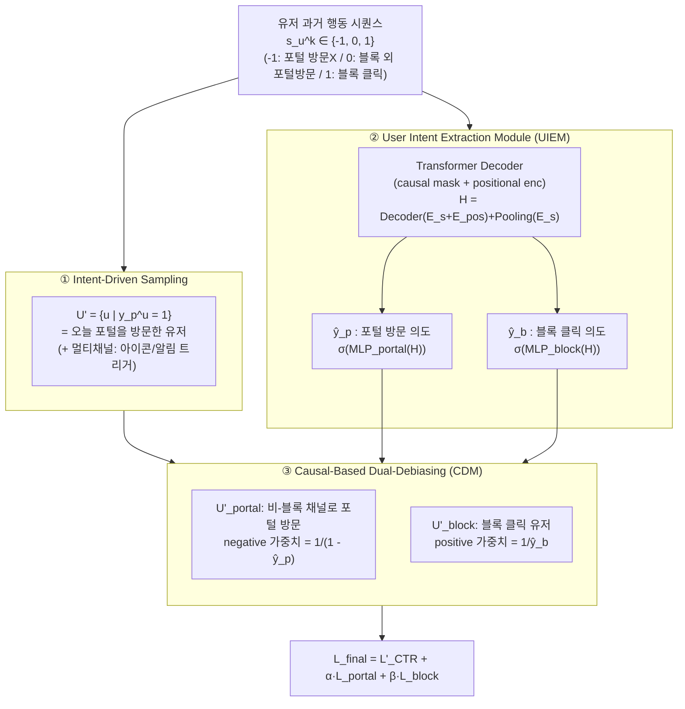
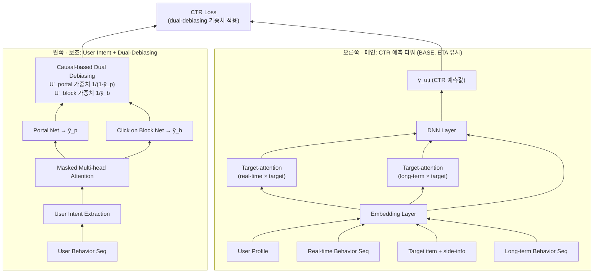

# USD: A User-Intent-Driven Sampling and Dual-Debiasing Framework for Large-Scale Homepage Recommendations, 2025 taobao

## 논문 정보
- **저자:** Jiaqi Zheng, Cheng Guo, Yi Cao, Chaoqun Hou, Tong Liu, Bo Zheng (Taobao & Tmall Group of Alibaba)
- **학회:** RecSys '25 (2025년 9월, Prague)
- **키워드:** Negative Sampling, Selection Bias, Recommender System
- **성과:** Taobao 홈페이지 마케팅 블록(Baiyibutie, Taobaomiaosha)에 실제 배포. 온라인 A/B에서 UCTR **+35.4% / +14.5%**

---

## 1. 문제 정의 (왜 어려운가)

Taobao 홈페이지에는 **마케팅 블록(Marketing Block)** 이라는 진입점이 있고, 유저가 여기를 클릭하면 별도의 **마케팅 포털(Marketing Portal, 예: 백억보조금/타오바오미아오샤)** 로 이동합니다. 즉 홈페이지 블록은 "아이템 자체에 대한 관심"이 아니라 "포털로 가고 싶은 의도" 때문에 클릭되는 경우가 많습니다.

여기서 두 가지 핵심 문제가 발생합니다.

| 문제 | 설명 |
| :--- | :--- |
| **Pseudo-positive (가짜 양성)** | 유저가 아이템이 좋아서가 아니라 **단지 포털로 가려고** 블록을 클릭. 클릭=관심으로 학습하면 왜곡됨. |
| **Invalid Exposure (무효 노출)** | 주의력 제약(attention constraint) 하에서 노출됐지만 실제로는 **못 본/무시된** 노출. 클릭 안 함 = 싫음이 아니라 **부주의(inattention)** 일 수 있음. |

- **Pseudo-positive** → 클릭 라벨이 오염됨 → **click bias**
- **Invalid exposure** → 노출 자체가 신뢰할 수 없음 → **exposure bias (SSB, Sample Selection Bias)**

기존 연구는 이 둘을 따로 다뤘습니다:
- **Sampling 계열:** 통계적 휴리스틱(fairness, distribution-based, in-batch)으로 negative를 뽑지만 **유저 의도(intent)를 무시**.
- **Debiasing 계열:** ESMM / ESCM² 처럼 IPW(inverse propensity weighting)를 쓰지만 **의도의 다양성(intention diversity)을 무시**.

> **USD의 기여:** 대규모 홈페이지 추천에서 invalid exposure와 SSB를 **동시에**, 그것도 **유저 의도(intent) 기반**으로 처리한 최초의 프로덕션 프레임워크.

---

## 2. 전체 구조 개요

USD는 크게 두 모듈로 구성됩니다.

1. **User Intent-Driven Negative Sampling** — 신뢰할 수 있는 샘플만 선별 (invalid exposure 필터링)
2. **Causal-Based Dual-Debiasing (CDM)** — exposure bias와 click bias를 **동시에** 보정
   - 이 보정에 쓰이는 의도 확률은 **User Intent Extraction Module (UIEM)** 이 만들어줌

### 2.1 Figure 1(b): 실제 모델 아키텍처

논문 Figure 1(b)를 재구성한 것입니다. 크게 **왼쪽(보조: 의도 추출 + 디바이싱)** 과 **오른쪽(메인: CTR 예측 타워)** 두 갈래가 하나의 CTR Loss로 합쳐집니다. 오른쪽 메인 타워가 실제 서빙에서 $\hat{y}_{u,i}$ 를 뽑는 부분(베이스라인 **BASE**, ETA 유사 구조)이고, 왼쪽은 그 학습을 편향 보정으로 도와주는 부분입니다.

**읽는 법:**
- **오른쪽 메인 타워** = 전형적인 CTR 모델. 유저 프로필 + 실시간/장기 행동 시퀀스 + 타겟 아이템을 임베딩 → 타겟 아이템 기준 **target-attention**(실시간·장기 시퀀스 각각) → DNN → 최종 `ŷ_u,i`. **이 값이 추천 랭킹에 실제로 쓰이는 예측값**.
- **왼쪽 보조 타워** = 유저 행동 시퀀스로부터 masked multi-head attention을 거쳐 `ŷ_p`(포털 의도), `ŷ_b`(블록 의도)를 산출 → 이 둘이 **각 학습 샘플의 신뢰도 가중치**가 되어 CTR Loss에 곱해짐.
- 두 타워는 **같은 CTR Loss로 함께 학습(end-to-end)** 되며, 학습이 끝나면 서빙에는 오른쪽 타워의 `ŷ_u,i` 만 사용.

> 참고: 오른쪽 타워 내부(실시간/장기 시퀀스 분리, target-attention 2갈래)는 Figure 1(b)의 도식과 "BASE는 ETA와 유사"라는 서술을 바탕으로 재구성한 것으로, 논문 본문에 각 레이어의 세부 하이퍼파라미터까지 나와 있진 않습니다.

---

## 3. 모듈별 상세

### 3.1 User Intent-Driven Negative Sampling (샘플 선별)

**아이디어:** 대규모 노출 데이터에서 랜덤 샘플링을 하면 "확실한 negative"를 많이 잃어버립니다(invalid exposure가 섞여있기 때문). 그래서 **실제 유저 행동을 직접 신호로** 사용합니다.

- 관찰: 아이템 클릭 → 포털로 이동하는 패턴이 반복되면, 유저의 "블록에 대한 의도"와 "포털에 대한 의도"가 정렬됨(cognitive schema).
- 특히 **같은 날(same-day)** 포털 방문이 cross-day보다 유저 의도와 더 강하게 상관됨.

$$
\mathcal{U}' = \{ u \in \mathcal{U} \mid y_p^u = 1 \} \quad (1)
$$

즉 **오늘 마케팅 포털을 방문한 유저** 만 학습 대상으로 삼습니다. 여기에 클릭뿐 아니라 **멀티채널 진입점(아이콘, 알림 트리거 등)** 까지 포함해 "포털로 가려는 일관된 잠재 의도"를 잡아냅니다. 단순 클릭 기반 샘플링보다 **신뢰도(reliability)** 가 높음(3.2 ablation에서 검증).

> **왜 "포털 방문 유저"만 학습에 쓸까? — confident negative 보존**
>
> 핵심은 **"믿을 수 있는 라벨만 남기기"** 입니다. invalid exposure(안 봤는데 노출된 것) 때문에 "노출됐는데 클릭 안 함 = 싫음"이라고 그냥 학습하면 라벨이 오염되고, 랜덤 샘플링은 이 노이즈에 묻혀 **진짜 '싫음' 신호(confident negative)를 잃습니다.**
>
> 1. **포털 방문 = 그날 이 도메인에 실제로 주의를 기울였다는 증거** → 관여(engaged)·주의(attentive) 상태가 행동으로 확인된 유저.
> 2. **주의를 기울인 유저의 "클릭 안 함"은 진짜 negative** → "못 봐서"가 아니라 "보고도 관심 없어서" = confident negative. 반대로 포털도 안 간 유저의 non-click은 부주의 노이즈라 버림.
> 3. **블록 의도 ↔ 포털 의도가 정렬됨** → 클릭→포털 경험이 반복되며 생긴 인지 스키마 덕분에, 포털 방문 여부가 "이 유저가 블록/아이템에 진짜 관심 있었는지"의 좋은 프록시가 됨.
> 4. **굳이 '오늘(same-day)'인 이유** → 같은 날 포털 방문이 cross-day보다 그날의 의도와 훨씬 강하게 상관. "오늘의 라벨"은 "오늘의 의도"로 판단.
>
> **요약:** 이 조건은 *"그날 이 도메인에 실제로 주의를 기울인 유저만 남기는 필터"* → invalid exposure 노이즈를 걷어내고 confident negative를 보존. (`-w/o PS` ablation에서 이 샘플링을 빼면 성능이 떨어지는 이유)

### 3.2 User Intent Extraction Module (UIEM, 의도 추출)

마케팅 블록 클릭은 (a) 아이템 관심 or (b) 포털 방문 의도 두 가지가 섞여 있음 → **fine-grained하게 분리**해야 함.

- 유저 의도는 **시간적 주기성(temporal periodicity)** 을 가지므로 정적 피처보다 **행동 시퀀스**가 낫다.
- 입력: 지난 한 달 행동 시퀀스 $s_u^k \in \{-1, 0, 1\}$
  - `-1` = 포털 방문 안 함, `0` = 블록 외 채널로 포털 방문, `1` = 블록 클릭

$$
\hat{y}_p^u = \sigma(\mathrm{MLP}_{portal}(H)) \quad (2), \qquad
\hat{y}_b^u = \sigma(\mathrm{MLP}_{block}(H)) \quad (3)
$$

$$
H = \mathrm{Decoder}(E_s + E_{pos}) + \mathrm{Pooling}(E_s) \quad (4)
$$

- $E_s$: 행동 시퀀스 임베딩, Decoder는 Transformer(causal mask + positional encoding).
- $\hat{y}_p^u$: 포털 방문 의도 확률, $\hat{y}_b^u$: **마케팅 블록 전체와 상호작용할 의도 확률** (아래 박스 참고).
- 학습 대상: **지난 주에 포털을 방문한 유저** $\hat{\mathcal{U}} = \{u \mid r_p^u = 1\}$. 이진 라벨 $y_p^u, y_b^u$ 로 보조 태스크(auxiliary task) 지도학습.

> **"마케팅 블록 전체와 상호작용할 의도"가 무슨 뜻?**
>
> 여기서 "마케팅 블록"은 클릭 버튼 하나가 아니라, 홈페이지 위에 놓인 **여러 요소로 이뤄진 위젯 덩어리**입니다. 논문 원문(Fig 1a)에 따르면 블록 안에는 **타이틀/배너 + 미리 노출된 아이템 2개**(+ 아이콘·트리거 등 진입점)가 들어 있고, 유저는 이 중 아무 곳이나 눌러 블록과 상호작용할 수 있습니다.
>
> 따라서 $\hat{y}_b^u$ 는 *"이 유저가 (아이템 하나가 아니라) **블록이라는 구역 자체를 건드릴 습관/성향**이 얼마나 되는가"* 의 확률입니다.
> - $\hat{y}_b^u$ **높음** → 평소 블록 안 아무거나 자주 누르는 유저 → 그 클릭은 "특정 아이템이 진짜 좋아서"보다 **습관일 가능성**이 큼 (pseudo-positive 의심)
> - $\hat{y}_b^u$ **낮음** → 평소 블록을 잘 안 건드리는 유저가 눌렀다 → 더 **진짜 관심 신호**
>
> 그래서 뒤의 디바이싱(식 7)에서 클릭한 positive에 $1/\hat{y}_b^u$ 가중치를 줘서, 습관 클릭 유저의 positive 신뢰도를 **낮춰** pseudo-positive를 완화합니다.
>
> **$\hat{y}_p$ vs $\hat{y}_b$ 한눈에:**
>
> | | 대상 | 질문 | 쓰임새 |
> | :--- | :--- | :--- | :--- |
> | $\hat{y}_p$ (포털 의도) | 도착지인 **마케팅 포털** | "(경로 불문) 포털에 가고 싶어하는 정도?" | 안 누른 negative 재가중 $1/(1-\hat{y}_p)$ |
> | $\hat{y}_b$ (블록 의도) | 홈페이지 위 **블록 위젯 전체** | "블록 구역 자체를 누를 습관/성향?" | 클릭한 positive 감쇠 $1/\hat{y}_b$ |
>

보조 손실 (BCE):

$$
\mathcal{L}_{portal} = \frac{1}{|\hat{\mathcal{U}}|} \sum_{u \in \hat{\mathcal{U}}} \big[ -y_p^u \log \hat{y}_p^u - (1 - y_p^u)\log(1 - \hat{y}_p^u) \big] \quad (5)
$$

$$
\mathcal{L}_{block} = \frac{1}{|\hat{\mathcal{U}}|} \sum_{u \in \hat{\mathcal{U}}} \big[ -y_b^u \log \hat{y}_b^u - (1 - y_b^u)\log(1 - \hat{y}_b^u) \big] \quad (6)
$$

### 3.3 Causal-Based Dual-Debiasing Module (CDM, 이중 편향 보정)

샘플링을 거친 $\mathcal{U}'$ 도 여전히 두 가지 이유로 편향됨:

1. **Click bias:** 마케팅 블록은 "진입점" 성격이라, 클릭이 **오직 포털로 가려는 목적**으로 생성됐을 수 있음.
2. **강한 포털 의도 + 클릭 안 함:** 이 경우는 "추천 아이템이 관심과 안 맞았다"는 강한 신호 → 이런 **negative 샘플에 더 높은 가중치**를 줘야 함.

그래서 $\mathcal{U}'$ 를 둘로 나눠 **IPS(Inverse Propensity Scoring)** 로 서로 다르게 보정합니다.

- $\mathcal{U}'_{portal}$: **비-블록 채널**로 포털을 방문한 유저
- $\mathcal{U}'_{block}$: **블록을 클릭**한 유저

$$
\mathcal{L}'_{CTR} =
\begin{cases}
\dfrac{1}{|\mathcal{U}'|} \displaystyle\sum_{(u,i)\in \mathcal{U}'} \dfrac{e(y_{u,i}, \hat{y}_{u,i})}{1 - \hat{y}_p^u}, & u \in \mathcal{U}'_{portal} \\[3mm]
\dfrac{1}{|\mathcal{U}'|} \displaystyle\sum_{(u,i)\in \mathcal{U}'} \dfrac{e(y_{u,i}, \hat{y}_{u,i})}{\hat{y}_b^u}, & u \in \mathcal{U}'_{block}
\end{cases}
\quad (7)
$$

- $\hat{y}_{u,i}$: 베이스라인 모델 **BASE**(ETA 유사 구조)가 예측한 CTR
- $e(\cdot)$: cross-entropy, $e(y_{u,i}, \hat{y}_{u,i}) = -y_{u,i}\log\hat{y}_{u,i} - (1-y_{u,i})\log(1-\hat{y}_{u,i})$

**가중치의 직관 (핵심):**

| 그룹 | 가중치 | 의미 |
| :--- | :--- | :--- |
| $\mathcal{U}'_{portal}$ (클릭 안 한 negative) | $\dfrac{1}{1-\hat{y}_p^u}$ | 포털 방문 의도 $\hat{y}_p^u$ ↑ 일수록 가중치 ↑ → "포털 가고 싶었는데도 이 아이템은 안 눌렀다" = 강한 negative 신호를 **증폭** |
| $\mathcal{U}'_{block}$ (클릭한 sample) | $\dfrac{1}{\hat{y}_b^u}$ | 블록 클릭 의도 $\hat{y}_b^u$ ↑ 일수록 가중치 ↓ → "습관적으로 블록 누르는 유저"의 클릭은 **신뢰도 낮음**으로 감쇠 (pseudo-positive 완화) |

즉, **한 손실 안에서 exposure bias(무효 노출 negative 재가중)와 click bias(가짜 양성 감쇠)를 동시에** 잡는 것이 "dual-debiasing"의 핵심입니다.

### 3.4 최종 손실

$$
\mathcal{L}_{final} = \mathcal{L}'_{CTR} + \alpha \cdot \mathcal{L}_{portal} + \beta \cdot \mathcal{L}_{block} \quad (8)
$$

- $\alpha, \beta$: 포털/블록 보조 태스크 가중치 (실험에서 $\alpha = \beta = 0.0001$)

---

## 4. 실험

### 4.1 세팅
- **데이터:** Taobao 산업용 데이터셋. 학습 **14.5억(1.45B)** 샘플(60일 수집), 평가 **9,700만(97M)** 샘플.
- **A/B:** 수천만 명 대상, 1주일.
- **베이스라인:** BASE, ESMM, DCMT, ESCM²-IPW, ESCM²-DR, NISE(pseudo-labeling).
- **최적화:** AdagradDecayV2, lr=0.01, batch=1024, debiasing weight는 $[1, 15]$ 로 clip.
- **지표:** GAUC(주지표, 클래스 불균형 때문), AUC(보조).
  - $\text{GAUC} = \dfrac{\sum_{u} w_u \cdot \text{AUC}_u}{\sum_u w_u}$, $w_u$ = 1 / 노출수 / 클릭수 → 각각 GAUC$_{avg}$ / GAUC$_{show}$ / GAUC$_{click}$

### 4.2 성능 비교 (오프라인)

| Method | GAUC$_{avg}$ | GAUC$_{show}$ | GAUC$_{click}$ | AUC |
| :--- | :---: | :---: | :---: | :---: |
| BASE | 0.5363 | 0.5496 | 0.5401 | 0.6491 |
| ESMM | 0.5991 | 0.6166 | 0.6055 | 0.7910 |
| NISE | 0.5436 | 0.5595 | 0.5579 | 0.6996 |
| ESCM²-IPW | 0.5410 | 0.5559 | 0.5553 | 0.6951 |
| ESCM²-DR | 0.5633 | 0.5756 | 0.5721 | 0.7481 |
| DCMT | 0.6026 | 0.6194 | 0.6080 | 0.8132 |
| **USD** | **0.6275** | **0.6462** | **0.6326** | **0.8252** |

→ 모든 지표에서 SOTA.

### 4.3 Ablation (모듈 필요성 검증)

| 변형 | 제거한 것 | 결과 |
| :--- | :--- | :--- |
| **-w/o D** | Dual-Debiasing 모듈 전체 제거 | GAUC$_{avg}$ **-2.55%** (가장 큰 하락) |
| **-w/o PS** | 의도 기반 샘플링 제거(클릭 샘플링만) | BASE보단 낫지만 USD보다 하락 → 샘플러가 confident negative 보존 확인 |
| **-w/o P** | portal-debiasing 제거 | 하락 |
| **-w/o B** | block-debiasing 제거 | GAUC$_{avg}$ **-0.82%** |

→ 세 모듈 모두 기여. 특히 dual-debiasing이 가장 중요.

### 4.4 온라인 A/B
- Baiyibutie(백억보조금): UCTR **+35.4%**
- Taobaomiaosha(타오바오 미아오샤): UCTR **+14.5%**
- 현재 Taobao 홈페이지 마케팅 블록에 **완전 배포 완료.**

---

## 5. 한 줄 요약 & 인사이트

- **문제:** 홈페이지 블록 클릭은 "아이템 관심"이 아니라 "포털 진입 의도"인 경우가 많고(pseudo-positive), 안 본 노출도 많다(invalid exposure). 클릭/노출 라벨을 그대로 믿으면 안 됨.
- **해법:** ① 실제 유저 의도(오늘 포털 방문)로 **믿을 수 있는 샘플만 선별**, ② Transformer로 **포털/블록 의도 확률을 추출**, ③ 그 확률을 IPS 가중치로 써서 **exposure bias와 click bias를 한 손실에서 동시 보정**.
- **핵심 트릭:** negative(안 누름)는 포털 의도가 높을수록 **가중↑**, positive(클릭)는 블록 습관 의도가 높을수록 **가중↓**. → 유저의 진짜 아이템 선호를 분리.

### 연관 개념
- Selection Bias / IPW 계열 — [[An Empirical Study of Selection Bias in Pinterest Ads Retrieval, 2023 Pinterest]] 와 문제의식 유사(훈련-서빙 분포 불일치). 단, USD는 pseudo-labeling 대신 **유저 의도 기반 재가중**으로 접근.
- ESMM / ESCM² 계열 대비 "intention diversity"를 추가한 점이 차별점.
