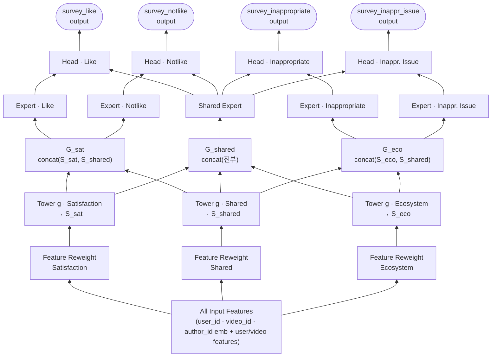

# Unified Survey Modeling to Limit Negative User Experiences in Recommendation Systems (TikTok, 2025)

- RecSys '25 (TikTok)
- 저자: Chenghui Yu, Haoze Wu, Jian Ding, Bingfeng Deng, Hongyu Xiong
- 링크: https://doi.org/10.1145/3705328.3748108

## 1. 문제의식
- 추천 플랫폼에서 부정적 경험(부적절한 콘텐츠 노출)을 줄이는 건 매우 중요. 사용자의 심리적 피해 + 이탈 → 장기 성장 저해.
- 하지만 추천 알고리즘은 대개 **positive feedback에 편향**됨. negative signal이 상대적으로 희소하기 때문.
- 기존처럼 negative feedback을 직접 모델링하는 방식의 한계:
  - 플랫폼이 가진 negative signal 종류가 적음(dislike, report, skip 정도) → 특정 문제(예: "폭력적") 맞춤 대응이 어려움.
  - negative signal이 **고빈도 유저에게 과대 표현(over-presented)** → 심한 user bias.

## 2. 이 모델을 추천에서 어떻게 쓰나 (전체 그림 먼저)
한마디로: **"유저가 이 영상에 대해 설문을 했다면 나왔을 법한 선호를 예측하고, 그 값을 추천 랭킹의 신호로 사용"** 한다.

- survey model 자체는 **메인 추천 랭커가 아니다.** 랭커에 넣을 **보조 신호(점수)를 만드는 별도 모델**.
- "personalized"인 이유: 같은 영상도 유저마다 다르게 느낌 → `user_id` 임베딩·user feature를 받아 **유저별로 다른 설문 반응 점수**를 냄.

### 사용 흐름
1. **소수 유저가 실제 설문에 응답** (하루 유저의 약 3%) → 희소한 정답 라벨 확보.
2. **survey model 학습**: (user, video) → "이 유저가 이 영상을 좋다/부적절하다고 답할 확률".
3. **응답 안 한 대다수 (user, video) 쌍에도 예측(imputation)** → 전 조합에 대해 "설문했다면 나올 법한 선호"를 dense하게 채움.
4. **이 예측 점수를 추천 랭킹의 신호로 투입** → 유저가 "부적절"이라 느낄 영상은 덜, "좋다"고 할 영상은 더 노출.

> ⚠️ 단, **정확히 어떤 형태로 꽂는지**(랭커의 추가 feature / value formula의 가중항 / 임계값 기반 demote 등)는 이 4쪽짜리 논문에 명시되지 않음. 개념은 "예측한 설문 선호를 추천 신호로 활용"이 확실하나, 구현 레벨은 특정 불가. (선행연구 [[Improve the Personalization of Large-Scale Ranking Systems by Integrating User Survey Feedback, 2025 Meta]]는 value formula의 추가 input feature로 투입한다고 명시.)

## 3. 한눈에: Input은 뭐고 무엇을 예측하나
- **Input (X): 하나의 (user, video) 쌍의 feature.**
  - Universal embedding: `user_id`, `video_id`, `author_id`.
  - user-side / video-side feature들.
  - → 전부 concat해서 입력 벡터 `I` (차원 D).
- **Output (Y): 그 유저가 그 영상에 대해 설문에서 내놓을 반응의 확률** (head별 binary classification, 그래서 지표가 AUC / LogLoss).

| Head | 예측 대상 (확률) |
|---|---|
| `survey_like` | 이 영상을 "좋다"고 응답할 확률 |
| `survey_notlike` | "안 좋다"고 응답할 확률 |
| `survey_inappropriate` | "부적절하다(no/18+)"고 응답할 확률 |
| `survey_inappropriate_issue` | 부적절 이유별(폭력·혐오 등) 응답 확률 |

- **왜 이렇게?** 실제 설문은 하루 유저의 **약 3%만 응답** → 라벨이 매우 희소. 그래서 응답한 소수 데이터로 학습한 뒤, **응답하지 않은 모든 (user, video) 쌍의 설문 반응을 예측(imputation)**한다.
- 이 예측 점수를 **메인 추천 랭킹의 추가 신호**로 투입 → 유저가 "부적절하다 느낄" 영상은 덜 노출, "좋아할" 영상은 더 노출. 즉 **부정 경험 억제용 신호를 dense하게 확장**하는 것이 목적.

## 4. 핵심 아이디어: In-feed Survey로 부정 신호를 직접 수집
설문(survey)으로 이 문제들을 우회한다.
- **커스텀 질문**으로 기존 피드백이 못 잡는 구체적 negative signal을 수집 가능.
- **빈도 제어(frequency control)**로 모든 유저에게 고르게 배포(예: 유저당 14일에 1회) → user bias 완화.

### TikTok이 운영하는 두 종류의 설문
1. **Satisfaction Survey (만족도 설문)**
   - "최근 본 영상이 좋았나?" → like / neutral / not like.
   - `survey_like_rate` = "like" 응답 수 / 전체 응답 수.
   - 이 지표가 플랫폼 **DAU(일간 활성 사용자)와 강한 상관관계**를 보임.
2. **Ecosystem Survey (생태계/적절성 설문)**
   - "이 영상이 플랫폼에 적절한가?" → yes / no / only for 18+.
   - "no" 또는 "18+" 선택 시 **2차 페이지**로 이유를 물음: disgusting, violent, spam, hateful, sexually suggestive, uninteresting, others. 각 옵션 = 플랫폼의 핵심 콘텐츠 이슈.
   - `survey_inappropriate_rate` = ("no" + "18+") 응답 수 / 전체 응답 수.

### 데이터 규모 (참고)
- 매일 satisfaction 약 1,400만 건 / ecosystem 약 2,000만 건 배포, 약 3%의 유저가 응답.
- Satisfaction 응답 분포: like 74% / neutral 11% / not like 15%.
- Inappropriate 응답 분포: yes 88% / no 8% / 18+ 4%.

수집한 설문 응답으로 딥러닝 survey 모델을 학습 → 예측값을 추천 시스템에 통합.

## 5. 모델 구조: HoME 기반 계층적 MoE (핵심 기여)
Kuaishou의 **HoME (Hierarchy of Multi-Gate Experts)** 구조를 차용. 여러 head(설문 학습 태스크)를 가진 multi-head 아키텍처인데, **비슷한 속성의 head들을 그룹으로 묶어** intra-group(그룹 내) + cross-group(그룹 간) 정보를 함께 학습 → 특수성(specificity)과 일반화(generalization)를 동시에 확보.

### 전체 구조 한눈에 보기 (Figure 2)
아래로 갈수록 입력, 위로 갈수록 출력. 핵심은 가운데 **Shared 그룹이 양쪽(Satisfaction·Ecosystem)과 서로 concat되어 정보를 흘려보내는 것**(cross-group).

읽는 법:
- **세로 3층 = 3개 블록**: Reweight(전처리) → Tower g(그룹 상호작용) → Expert f + Head k(head 출력).
- **가로 3열 = 3개 그룹**: 왼쪽 Satisfaction / 가운데 Shared / 오른쪽 Ecosystem.
- **Shared 열이 다리 역할**: `S_shared`가 양옆 그룹 출력에 concat되고, `Shared Expert` 출력은 모든 head의 최종 tower에 다시 concat → 그룹별 전문성은 지키면서 공통 정보도 공유.

### head를 3개 그룹으로 분류
- **Satisfaction 그룹**: survey_like, survey_notlike head.
- **Ecosystem 그룹**: survey_inappropriate head + 2차 페이지의 이슈별 head(hateful, violent 등) = survey_inappropriate_issue head.
- **Shared 그룹**: 위 두 그룹 사이의 공유 정보를 담는 그룹.

### 3개 블록으로 구성
1. **Feature Preprocessing Block (특징 전처리)**
   - 입력: user_id / video_id / author_id의 universal embedding + user/video-side feature들을 concat → 입력 `I` (차원 D).
   - **feature reweighting** 적용: 그룹별 2-layer FC 네트워크로 가중치 `W_i`를 만들어 `I`와 element-wise 곱 → 그룹별 입력 `T_i`.
   - 수식: `W_i = 2·σ(W_i2·ReLU(W_i1·I + b_i1) + b_i2)`, `T_i = W_i ⊙ I` (SE-Net 스타일 게이팅).
2. **Group Interaction Block (그룹 상호작용)**
   - 그룹별 dense tower `g_i`가 `T_i` → `S_i` 생성.
   - 그룹 출력 `G_i`는 자기 tower + shared tower 출력을 concat:
     - `G_satisfaction = concat(S_satisfaction, S_shared)`
     - `G_ecosystem = concat(S_ecosystem, S_shared)`
     - `G_shared = concat(S_satisfaction, S_ecosystem, S_shared)` (shared는 전부 통합)
3. **Head Output Block (head별 출력)**
   - 각 head마다 전용 expert tower `f_h`, shared 그룹은 공용 expert tower 하나.
   - head 최종 출력 tower `k_h`의 입력 = (자기 expert 출력 + shared expert 출력) concat.
     - `E_h = f_h(G_g)`, `O_h = k_h(concat(E_h, E_shared))`.

## 6. 실험

### Baseline
- multi-head 아키텍처 + **LHUC (Learning Hidden Unit Contribution)** 모듈로 개인화 강화한 모델. (mini-batch 1024)

### Offline (AUC ↑ 좋음 / LogLoss ↓ 좋음)
| Head | AUC (base→exp) | LogLoss (base→exp) |
|---|---|---|
| Like Survey | 0.81903 → 0.82402 (+0.61%) | 0.44849 → 0.44146 (-1.57%) |
| Notlike Survey | 0.82836 → 0.83279 (+0.53%) | 0.33550 → 0.33033 (-1.54%) |
| Inappro. Survey | 0.80813 → 0.81164 (+0.43%) | 0.20772 → 0.20557 (-1.03%) |
- 전체 head 평균 **AUC +0.52%, LogLoss -1.38%**.

### Online A/B (TikTok 앱, 약 1,400만 유저, 1개월)
| Metric | Δ | 의미 |
|---|---|---|
| `survey_like_rate` | **+0.82%** | 만족도 ↑ |
| `survey_inappropriate_rate` | **-4.08%** | 부적절 인식 ↓ |
| Like | **+0.67%** | engagement ↑ |
| Dislike | **-2.59%** | negative ↓ |
| Report | **-2.51%** | negative ↓ |

→ 추천 품질은 올리고 negative signal은 동시에 낮춤.

## 7. 핵심 takeaway
- **설문(explicit survey)은 희소하고 편향된 negative signal 문제를 푸는 좋은 수단**: 커스텀 질문으로 구체적 이슈를 잡고, 빈도 제어로 user bias를 줄인다.
- 여러 설문 태스크를 하나로 모델링할 때, **HoME식 계층적 그룹핑(intra + cross group + shared)**이 개별 head 학습보다 offline/online 모두 우수.
- feature reweighting(SE 스타일) + LHUC 대비 그룹 상호작용 구조가 실제 대규모 배포에서 유의미한 개선을 만듦.
- 같은 팀의 선행연구 **USM (Unbiased Survey Modeling, 2024, arXiv:2412.10674)**의 연장선. Meta의 [[Improve the Personalization of Large-Scale Ranking Systems by Integrating User Survey Feedback, 2025 Meta]]와 문제의식이 유사(설문 피드백을 랭킹에 통합)하나, 이쪽은 **negative/부적절 경험 억제 + 멀티태스크 설문 모델 구조**에 초점.
