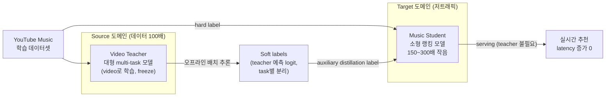
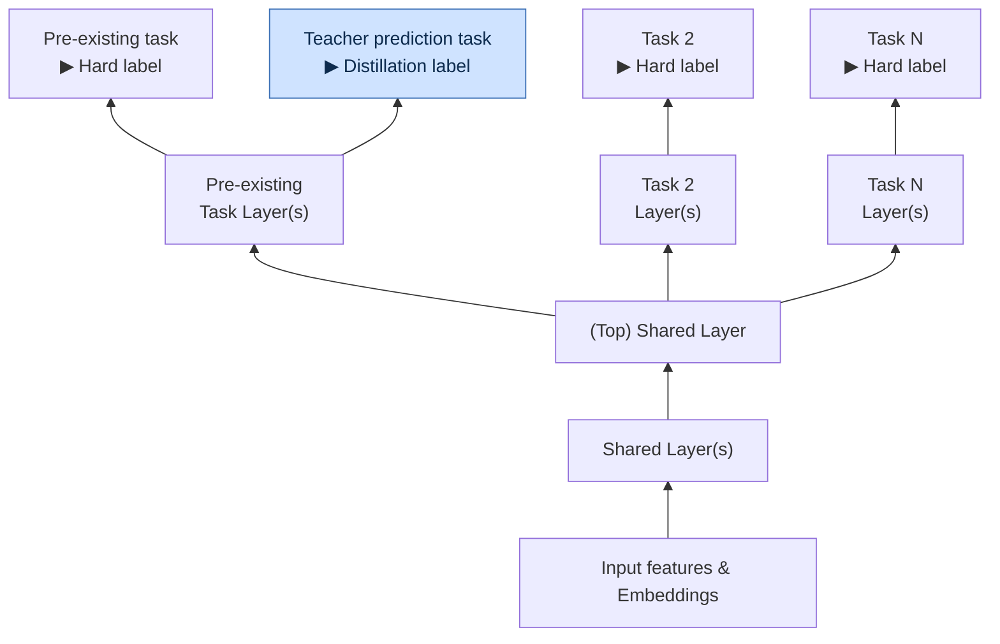

# Zero-shot Cross-domain Knowledge Distillation: A Case study on YouTube Music

- RecSys 2025, Google (YouTube Music)
- Srivaths Ranganathan, Chieh Lo, Bernardo Cunha, Nikhil Khani, Li Wei, Aniruddh Nath 외

## 핵심 요약

트래픽이 적은(low-traffic) 추천 서비스에서는 학습 데이터가 부족해 큰 teacher 모델을 학습/유지하기 어렵고, 그래서 **Knowledge Distillation(KD)의 효과를 보기 어렵다**. 이 논문은 데이터가 풍부한 **YouTube 동영상 추천 teacher 모델(100배 많은 데이터)**을, 트래픽이 훨씬 적은 **YouTube Music** 랭킹 student 모델로 지식을 전이하는 **zero-shot cross-domain KD(CDKD)** 사례를 다룬다. feature/UI/task가 도메인 간 크게 다른데도, teacher의 예측을 **auxiliary distillation task**로 추가해 shared layer의 표현력을 개선함으로써 오프라인·온라인 모두에서 유의미한 성능 향상을 얻었다.

## 문제 정의

- Latency 제약이 있는 실시간 추천에서 KD는 널리 쓰이지만, **저트래픽 도메인에서는 KD 적용이 어렵다**
  - 데이터가 적어 teacher 모델 크기가 제한됨 → overfitting, 효과 감소
  - 대형 teacher를 별도로 학습/유지하는 운영 비용이 정당화되지 않음
- **Cross-domain KD**가 대안: 데이터가 풍부한 source 도메인(YouTube 동영상)의 teacher를 활용해, latency 증가 없이 작은 도메인(YouTube Music)의 모델 품질을 높일 수 있음
- 하지만 source↔target 도메인의 격차 때문에 세 가지 challenge 발생

### 도메인 간 challenge

1. **Feature set mismatch**: Music 랭킹 모델과 Video teacher 모델이 독립적으로 발전 → teacher가 기대하는 입력 feature 중 **최대 40%가 Music 표면에 없음**. 없는 feature는 default 값으로 fallback
2. **Task / Label 분포 divergence**: teacher가 예측하는 task가 Music task와 정확히 맞지 않고, 비슷한 task라도 label 분포가 다름
   - 예: YouTube Music 홈페이지는 콘텐츠를 **"shelf(선반)" 단위로 묶어** 보여줌 (YouTube의 개별 영상 피드와 다름) → CTR이 두 표면 간 약 **2% 차이**
3. **User behavior 패턴 차이**: 음악 소비는 영상과 다름 (반복 재생 잦음, 탐색 적음, 세션 김) → 데이터 분포 자체가 달라 teacher가 학습한 신호의 관련성이 떨어짐

## 접근 방법: Zero-shot Cross-Domain KD

- 기존 **YouTube용 대형 multi-task teacher 모델**을 그대로 활용해 Music 랭킹 모델 개선
- **오프라인 배치 label augmentation 파이프라인** 구축: teacher 모델이 Music 데이터셋에 대해 **추론(inference)**을 수행 → 그 예측(soft label)을 Music student 학습 시 auxiliary task로 사용
  - GPU 학습 시간·엔지니어링 유지보수 비용을 크게 절감
- **"Zero-shot"의 의미**: teacher를 Music 도메인에 재학습/파인튜닝하지 않고, video로 학습된 teacher의 예측을 그대로 distillation label로 쓴다

### 오프라인 label augmentation 파이프라인

teacher는 학습에 관여하지 않고 **오프라인 배치 추론**으로 soft label만 만들어 둔다. 실시간 serving에는 student만 쓰이므로 latency 증가가 없다.

### Student 모델 아키텍처 (Figure 1)

하나의 task tower에 **teacher 예측을 맞추는 auxiliary head**를 덧붙인다. 이 보조 loss가 shared layer 표현을 개선해, 직접 distill하지 않은 task까지 함께 좋아진다. (파란색 = teacher에서 온 distillation 신호)

- **핵심**: teacher head(파란 박스)는 학습 때만 존재하는 auxiliary task → serving 시에는 hard-label head들만 사용
- Homepage: `CTR`, `Trail engagement` tower에 각각 teacher logit 예측 head 추가 (`music discovery`는 대응물 없어 제외)
- Radio: 공유 task가 없어 **"Continue Watching"을 예측하는 non-serving head**를 새로 만들어 붙임

### 설계 핵심

- teacher의 예측 logit을 **task별로 분리(separate logits)**해 distill → label bias 완화
- 여러 task가 **shared layer**의 표현을 함께 개선하도록, shared benefit이 큰 distillation task를 선택
- 과거에는 teacher의 video 도메인에서 **sampled data**를 함께 넣어 지식 전이를 시도했으나, 학습 불안정 + non-target 도메인 데이터 의존성을 만들었고 이 의존성 제거는 실패 → 본 논문의 접근이 이를 우회

### 두 개의 student 모델 (Figure 1)

**1) Homepage 모델** (CTR, trail engagement 예측)
- **trail engagement**: 아이템 클릭 후 얼마나 오래 청취하는지 예측하는 task
- 이 두 task의 tower를 augment해 teacher로부터 추가 logit도 예측하도록 → **오직 YouTube Music 데이터만으로** 학습
- Homepage의 세 번째 주요 task인 **music discovery**는 teacher에 대응물이 없어 distill하지 않음

**2) Radio 모델** (음악 라디오 시퀀싱)
- video teacher와 공유하는 task가 없던 상황 → **새로운 "non-serving" task head**를 추가
- teacher의 "Continue Watching" task의 soft label(현재 영상을 보면 이후 영상 시청으로 이어질지)을 예측하도록 학습
- 이를 통해 Radio 모델을 out-of-domain video 소스와 **분리(decouple)**하면서 KD로 지식 전이

## 실험 결과

Baseline(control) 모델은 student와 **동일한 아키텍처**이되 auxiliary KD task head와 loss만 없음. 학습 시점·스텝 수도 동일하게 맞춤.

### Finding 1: teacher 성능이 낮아도 zero-shot KD는 효과적

Video teacher는 Music 표면과 UI/행동이 달라 distill된 task에서 control보다 정확도가 낮음. 그럼에도 **student는 auxiliary KD로 baseline을 능가**.

**Table 1 — Homepage student (오프라인)**

| Homepage Task | Control | Teacher | Cross-Domain Student |
|---|---|---|---|
| CTR (AUC) | 79.34 | 75.40 | **79.55** |
| Trail Engagement (R²) | 0.312 | 0.267 | **0.320** |

→ teacher 자체는 control보다 나쁜데도, student는 control을 앞선다.

### Finding 2: Cross-task 성능 향상 (distill 안 한 task도 개선)

KD가 shared 표현을 개선해, **직접 distill하지 않은 task까지** 성능이 오름.

**Table 2 — non-distilled task (오프라인 AUC)**

| Task | Control AUC | Cross Domain Student AUC |
|---|---|---|
| Homepage Discovery Task | 76.06 | **76.22** |
| Radio Engagement Task | 90.30 | **91.38** |

- Radio 모델의 경우, distill한 non-serving task가 primary engagement task의 AUC를 끌어올림 → **Radio는 오직 이 cross-domain distillation 덕분에** 온라인 성능이 개선됨

### Finding 3: 온라인 지표에서 유의미한 향상

각 실험 2주간 진행, 두 primary 지표(engagement, music discovery)에서 통계적 유의(p<0.05) 향상. YouTube 규모상 신규 아이템이 teacher 데이터셋에 훨씬 자주 등장 → **신규 릴리스에서 특히 큰 효과**.

**Table 3 — 온라인 지표**

| Surface | Engagement | Discovery | New Releases Engagement |
|---|---|---|---|
| Homepage | +0.58% | +1.12% | **+11.39%** |
| Radio | +0.70% | +2.13% | +0.96% |

- 오프라인 이득은 완만한데 온라인 이득이 큰 건 산업 추천에서 흔한 현상
- CDKD의 핵심 효용은 **모델의 일반화 능력과 신규 콘텐츠 대응력 향상** → AUC 같은 오프라인 지표는 실제 사용자 만족/신규 발견의 변화를 다 담지 못함

## 결론 및 향후 과제

- Latency 제약이 있는 저트래픽 추천에서, 데이터가 풍부한 인접 도메인의 지식을 전이하는 **zero-shot CDKD**가 효과적임을 실서비스로 검증
- task/feature space/데이터 특성의 격차를 넘어서는 distillation 기법 제시
- **teacher가 target 도메인에서 정확도가 낮아도 student 성능은 향상**되고, 직접 distill하지 않은 task에도 긍정 효과가 파급됨
- 특히 **신규 아이템/트렌드 적응**에서, source 데이터로 직접 학습하는 것보다 zero-shot CDKD가 일반화에 유리
- 향후: 다른 Music 모델/표면으로 확장, teacher 예측에 random noise를 추가하는 ablation(privileged information 영향 분석), student feature set 확장 및 student 스케일업 시 효과 분석

## 메모 / 시사점

- **핵심 아이디어**: teacher를 target 도메인에 재학습하지 않고, video teacher의 예측을 Music student의 **auxiliary(보조) task label**로만 붙여 shared layer 표현을 개선한다. Serving은 여전히 작은 student 단독 → latency 증가 0.
- teacher가 나쁜 예측을 해도 도움이 되는 이유는, distillation이 정답을 그대로 베끼는 게 아니라 **shared representation을 regularize**하고 신규 콘텐츠에 대한 신호를 공급하기 때문으로 해석됨.
- 대응 task가 아예 없으면 (Radio처럼) **teacher의 다른 task("Continue Watching")를 non-serving head로 빌려와** distill하는 우회가 실용적.
